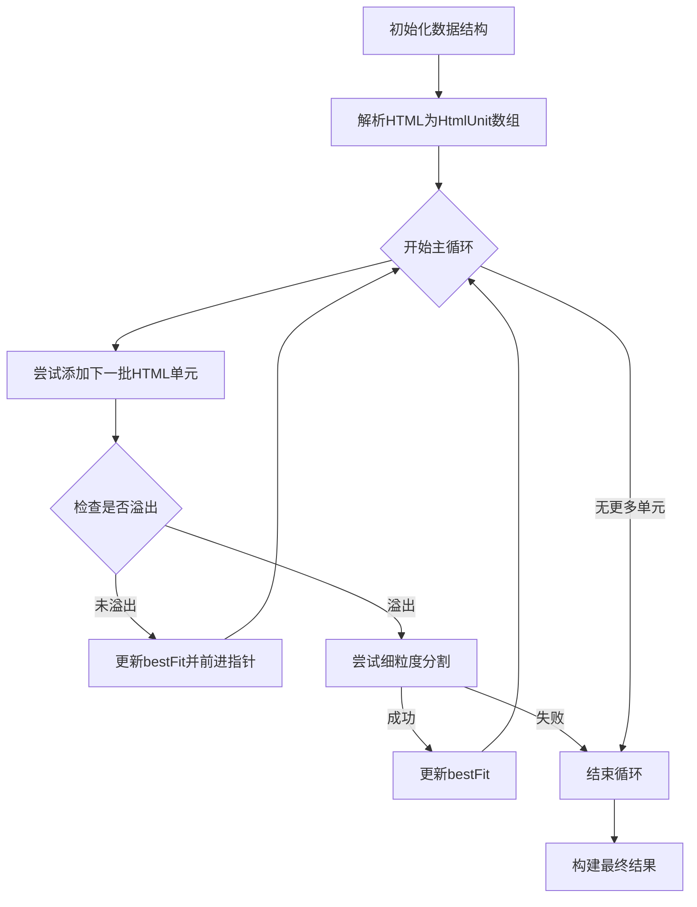

# `splitForSingleLineFit` 算法与实现

> 📌 **文档关联**
> - 上一篇: [DOM 行分割问题与目标](./dom-based-row-problem-goals.md)
> - 返回: [README](./README.md)
> - 旧版文档: [DOM-based Row Splitting](./dom-based-row-splitting.md)

## 1. 核心方法：迭代式 HTML 节点适配

`splitForSingleLineFit` 函数采用迭代式 HTML 节点适配方法，通过逐步添加 HTML 单元并实时测试是否导致页面溢出，确保分割点能够保持 HTML 结构的完整性。

### 1.1 关键数据结构

- **CellData[]**: 表示行中所有单元格的数据，包含 `html`、`content`、`colSpan` 等属性
- **HtmlUnit[][]**: 二维数组，存储每个单元格的 HTML 单元（标签或文本节点）
- **cellUnitPointers[]**: 数组，跟踪每个单元格中下一个待处理的 HTML 单元索引
- **bestFitCellsData[]**: 存储已确认适合当前页面的 HTML 内容
- **candidateCellsData[]**: 用于当前迭代测试的临时数据

### 1.2 算法流程



#### 1.2.1 初始化

1. 解析每个单元格的 HTML 内容为 `HtmlUnit` 数组
2. 初始化 `cellUnitPointers` 为全零数组，表示从每个单元格的第一个 HTML 单元开始处理
3. 初始化 `bestFitCellsData` 和 `candidateCellsData` 为空 HTML 内容的单元格数组

#### 1.2.2 迭代适配循环

1. **添加单元**: 对每个单元格，尝试添加当前指针位置的 HTML 单元到 `candidateCellsData`
2. **测试溢出**: 使用 `createRowFromData` 创建测试行，并通过回调函数 `checkOverflow` 检查是否导致页面溢出
3. **处理结果**:
   - 如果**不溢出**：更新 `bestFitCellsData`，前进 `cellUnitPointers`，继续下一轮迭代
   - 如果**溢出**：尝试细粒度分割（`tryFineGrainedSplitAfterOverflow`），如果成功则更新 `bestFitCellsData` 并继续，否则结束循环

#### 1.2.3 处理结果

1. 构建 `firstLineData`：基于 `bestFitCellsData` 的 HTML 内容
2. 构建 `remainingData`：基于 `cellUnitPointers` 之后的剩余 HTML 单元
3. 确定是否实际发生了分割（`didSplit`）
4. 处理特殊情况：如果第一行为空但原始内容不为空，则调用 `handleNoFitContent`

### 1.3 优化单个过大单元

当单个 HTML 单元（如大段文本）导致溢出时，`tryFineGrainedSplitAfterOverflow` 函数会尝试在单元内部进行更细粒度的分割，确保即使是单个大型 HTML 单元也能被合理分割。

## 2. "HTML 单元"的定义与创建

### 2.1 HTML 单元类型

`HtmlUnit` 是算法中的基本处理单位，分为两种类型：

```typescript
interface HtmlUnit {
  type: 'tag' | 'text';
  htmlContent: string;  // 完整的HTML字符串表示
  // 对于tag类型，还包含标签名、属性等信息
}
```

### 2.2 HTML 解析与单元创建

`getCellHtmlUnits` 函数负责将 HTML 字符串解析为 `HtmlUnit` 数组，确保：

1. 标签的完整性（开始标签和结束标签配对）
2. 文本节点的合理分割
3. 嵌套结构的正确表示

## 3. 实际实现细节

实际代码实现中，`splitForSingleLineFit` 函数通过以下方式与 `TableHandler` 集成：

1. `TableHandler` 提供 `checkOverflow` 回调函数，用于测试行是否导致页面溢出
2. 回调函数在内部使用 `this.pdfPage.isCurrentPageHeightOverflow()` 检查溢出状态
3. 分割结果包含 `firstLineData` 和 `remainingData`，分别用于当前页面和下一页面

错误处理机制确保即使在解析复杂 HTML 时出现问题，也能提供合理的降级处理，避免整个渲染过程中断。

将 `splitForSingleLineFit` 重构为 HTML 感知模式，是对当前纯文本方法的重大升级。它有望为具有复杂内容的表格行提供更准确、结构更合理的分割。虽然实现上存在性能和 HTML 解析健壮性的挑战，但其带来的 PDF 渲染真度的提升是值得的。