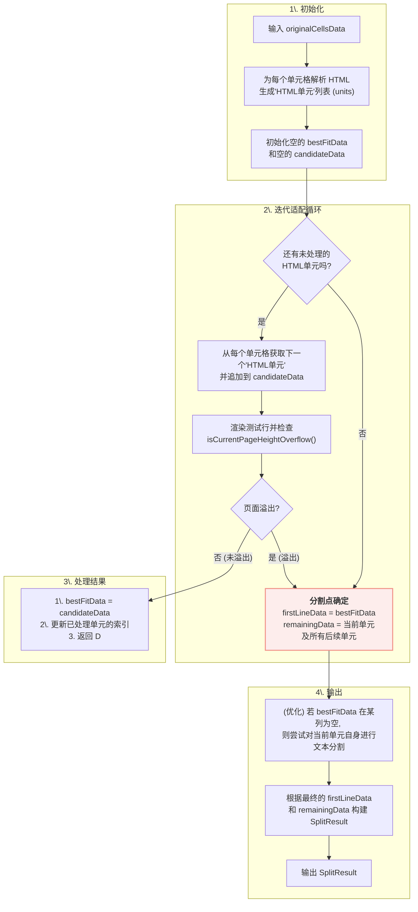

# 设计方案：`splitForSingleLineFit` 的基于DOM节点的行分割重构

## 1. 问题与目标

### 1.1. 现有问题

`splitForSingleLineFit` 函数负责分割因内容过多而无法在单行内完整显示的表格行。当前实现基于**纯文本长度**估算分割点，存在重大缺陷：
- **结构破坏**: 将 HTML 转换为纯文本进行测量，再将分割点映射回 HTML，此过程有损，极易破坏 HTML 标签的完整性。
- **预测不准**: 纯文本长度与渲染后的高度并非线性关系，尤其在富文本（如 `<b>`, `<span>`）场景下，预测非常不准。

### 1.2. 重构目标

核心目标是让分割过程**感知并尊重 HTML 结构**。
- **保证元素完整性**: 分割应优先发生在 HTML 元素**之间**，而非**之内**。
- **适配完整单元**: 每次迭代都尝试适配一个完整的 HTML 单元（如一个 `<span>` 标签或一个文本节点）。
- **优雅分割长文本**: 如果单个单元（如一段长文本）自身过大，则仅分割其内部文本，并保持其父标签包裹。
- **提高预测精度**: 直接使用部分 HTML 结构进行高度测试，实现更准确的高度预测。
- **保持 API 契约**: 保持输入/输出签名不变，最小化对调用方 `TableHandler` 的影响。

## 2. 核心方法：迭代式 HTML 节点适配

放弃纯文本估算，转而采用迭代地构建候选行的方法。每次向候选行中添加一个**HTML 单元**，然后渲染测试行并检查其高度，直到页面溢出。

### 2.1. 关键数据结构

| 数据结构 | 用途 |
| :--- | :--- |
| `originalCellsData` | **输入**: 原始的行数据，包含完整的 `html` 和 `content`。 |
| `htmlUnits` | **处理单元**: 将每个单元格的 HTML 解析成的 `HtmlUnit` 数组。每个单元是一个顶层节点（元素或文本）。 |
| `candidateData` | **构建区**: 在迭代中逐步构建的、用于测试的行数据。其 `html` 内容不断增加。 |
| `bestFitData` | **快照区**: 上一次成功适配（未溢出）的 `candidateData` 的快照，是最终分割点的依据。 |
| `remainingData` | **输出**: 所有未被放入 `bestFitData` 的内容。 |

### 2.2. 算法流程



### 2.3. 步骤详解
1.  **初始化**: 将每个输入单元格的 `html` 解析为一个 `HtmlUnit` 数组。`bestFitData` 和 `candidateData` 初始化为空。
2.  **迭代适配**:
    a. 只要还有未处理的 `HtmlUnit`，就继续循环。
    b. 从每个单元格中取出下一个 `HtmlUnit`，将其追加到 `candidateData` 的相应单元格中。
    c. 渲染测试行，并检查是否溢出 (`isCurrentPageHeightOverflow()`)。
    d. **若未溢出**: 说明 `candidateData` 可以适配。用其内容更新 `bestFitData`，并递增处理过的单元索引，返回 (b) 继续添加。
    e. **若溢出**: 说明刚刚添加的单元导致了溢出。循环终止。
3.  **结果构建**:
    - `firstLineData` 的内容就是上一次成功适配的 `bestFitData`。
    - `remainingData` 包含导致溢出的那个单元以及所有后续未处理的单元。
4.  **优化：处理单个过大单元**:
    - 如果在某次迭代中，`bestFitData` 在某个单元格中为空（意味着该单元格的第一个单元就导致了溢出），则会触发特殊处理。
    - 系统会尝试对这个过大的单元进行**内部文本分割**，找到能适配的最大文本前缀，并重新包裹上其父标签，形成最终的 `firstLineData`。

## 3. 核心概念："HTML 单元"的定义与创建

这是本方案最关键的部分。一个 HTML 单元是**顶层的 DOM 节点**，可以是一个元素节点，也可以是一个文本节点。

- **`getCellHtmlUnits(cellHtml: string): HtmlUnit[]`**:
  此函数负责将 HTML 字符串转换为单元数组。
  ```javascript
  // 伪代码
  function getCellHtmlUnits(cellHtml) {
    // 1. 使用 jQuery 或原生 DOM API 解析 HTML 片段
    const $wrapper = $('<div>').html(cellHtml);

    // 2. 获取所有直接子节点 (包括元素节点和文本节点)
    const childNodes = $wrapper.contents();

    // 3. 遍历子节点，创建单元
    return childNodes.map(node => {
      if (node.nodeType === 3) { // 文本节点
        return { type: 'text', htmlContent: node.nodeValue };
      }
      if (node.nodeType === 1) { // 元素节点
        return { type: 'element', htmlContent: node.outerHTML };
      }
    });
  }

  // 示例
  const html = "<p>第1行</p><span><b>粗体</b></span>文本节点";
  const units = getCellHtmlUnits(html);
  // units 会是:
  // [
  //   { type: 'element', htmlContent: '<p>第1行</p>' },
  //   { type: 'element', htmlContent: '<span><b>粗体</b></span>' },
  //   { type: 'text',    htmlContent: '文本节点' }
  // ]
  ```

这种方法确保了分割总是在顶层 DOM 节点之间进行，从而最大程度地保护了 HTML 结构的完整性。只有当单个单元自身过大时，才会进入更细粒度的文本分割逻辑。

## 4. 总结

将 `splitForSingleLineFit` 重构为 HTML 感知模式，是对当前纯文本方法的重大升级。它有望为具有复杂内容的表格行提供更准确、结构更合理的分割。虽然实现上存在性能和 HTML 解析健壮性的挑战，但其带来的 PDF 渲染真度的提升是值得的。 