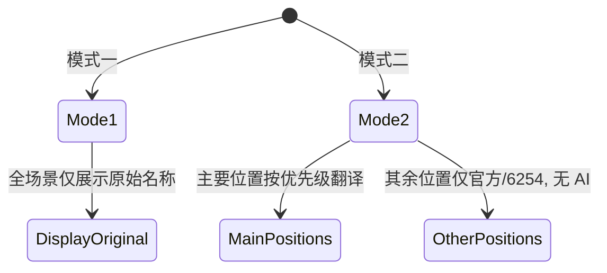
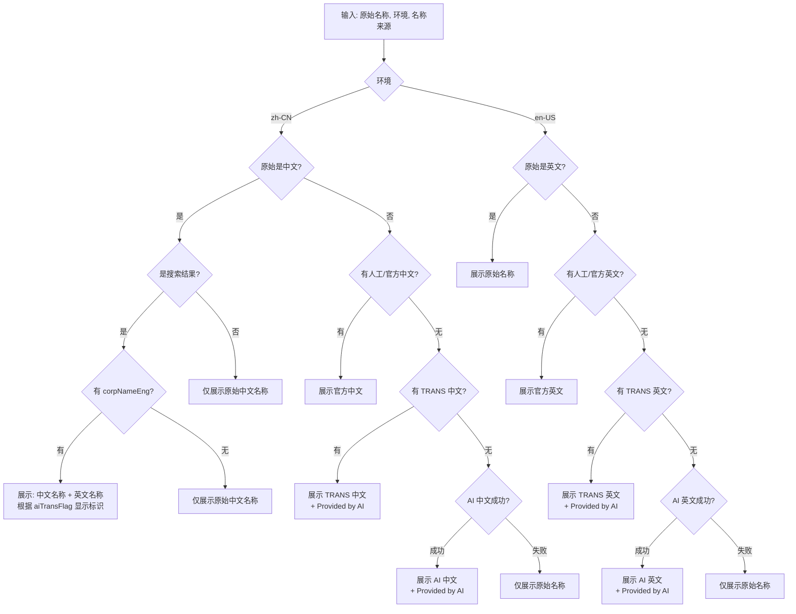

# 企业名称展示与取值规则（intl 扩展）

## 概述
规范企业名称在不同语言环境、不同展示场景下的取值优先级、翻译来源与展示样式，确保一致性与可追溯性。

## 名称来源定义
- 原始名称：来自业务字段
  - F2_6254=工商展示名称（境内用） → 取 F3_6254
  - F2_0088（如业务定义包含该字段）
- 人工/官方名称：来自业务维护或官方渠道
  - 中文名（满足任一条件即命中）：
    1) F2_6254=工商展示名称（境内用） → 取 F3_6254
    2) F2_6254=其他法团名称（香港用） → 取 F3_6254
    3) F2_6254=简体中文（港澳台用） → 取 F3_6254
    4) F2_6254=公司中文名（海外用） → 取 F3_6254
  - 英文名：
    1) F2_6254=公司英文名 且 F9_6254 非空 → 取 F3_6254
    2) corpNameEng 字段（搜索结果专用）
- TRANS 表（机翻表）：
  - 现支持模式：中翻英
  - 参数编码：source_Ing=343999001（简体中文），dest_Ing=343999003（英语）
  - 标识要求：展示时需带“Provided by AI”标识
- AI 翻译：实时调用 AI 翻译接口
  - 中文环境 → 翻译为中文
  - 英文环境 → 翻译为英文
  - 标识要求：展示时需带“Provided by AI”标识
  - 失败降级：不展示翻译名称，仅展示原始名称

注：“来自 6254 表的翻译名称”在本文中等同于“人工/官方名称取值逻辑”得到的目标语名称。

## 语言判断
- 按字符判断：
  - 含有中文字符（\u4e00-\u9fff）视为中文
  - 仅含英文字母/常见 ASCII 符号视为英文

## 取值优先级（大原则）

### 中文环境（`zh-CN`）
- 主要公司名称（搜索结果、企业详情页顶部卡片、图谱中心节点）：
  1) 若原始名称非中文：人工/官方中文名 → TRANS 表中文名 → AI 中文翻译；若原始名称为中文：展示原始名称
  2) **搜索结果特殊规则**：若原始名称为中文，则展示"中文名称 + 英文名称"上下两行，根据 aiTransFlag 决定是否显示"Provided by AI"标识
- 其余公司名称：
  - 若非中文：人工/官方中文名 → 原始值；若为中文：原始值

### 英文环境（`en-US`）
- 主要公司名称（搜索结果、企业详情页顶部卡片、图谱中心节点）：
  1) 若原始名称非英文：人工/官方英文名 → TRANS 表英文名 → AI 英文翻译；若原始名称为英文：展示原始名称
- 其余公司名称：
  - 若非英文：人工/官方英文名 → 原始值；若为英文：原始值

### 优先级总览表
| 环境 | 场景 | 原始为目标语? | 展示策略 |
|---|---|---|---|
| zh-CN | 搜索结果 | 是 | 原始中文 + corpNameEng（若存在，根据 aiTransFlag 显示标识） |
| zh-CN | 其他主要名称 | 是 | 原始名称 |
| zh-CN | 主要名称 | 否 | 人工/官方中文 → TRANS 中文 → AI 中文 |
| zh-CN | 其余名称 | 是 | 原始名称 |
| zh-CN | 其余名称 | 否 | 人工/官方中文 → 原始值 |
| en-US | 主要名称 | 是 | 原始名称 |
| en-US | 主要名称 | 否 | 人工/官方英文 → TRANS 英文 → AI 英文 |
| en-US | 其余名称 | 是 | 原始名称 |
| en-US | 其余名称 | 否 | 人工/官方英文 → 原始值 |

注：当前 TRANS 表仅支持“中→英”。若在中文环境需要“机翻中文名”，应扩展 TRANS 表支持“英→中”，否则回退至 AI 翻译。

## 显示模式（Mode 1/2）
为适配不同产品发布策略，企业名称展示支持两种模式：

- 模式一（不做数据翻译）：
  - 所有位置均不做翻译处理，始终展示原始名称（若原始为目标语则自然一致）
- 模式二（主要位置可翻译，其他位置不做 AI）：
  - 三类主要位置：允许翻译（遵循上文“主要名称”优先级，含官方/TRANS/AI）
  - 其余位置：不进行 AI 翻译，仅可展示来自 6254 表的翻译名称；若无则回退原始值

为避免歧义：本文将“三类主要位置”固定为“搜索结果卡片、企业详情页顶部卡片、图谱中心节点”。若业务需在模式二中将“图谱中心节点”归入其余位置，请在实现中按下表调整该行归属。更多关于模式的全局说明，参见：`./i18n-display-modes.md`。

### 模式选择流程

### 模式-场景矩阵（展示与来源）
| 模式 | 场景 | 显示样式 | 翻译来源 | 备注 |
|---|---|---|---|---|
| 模式一 | 主要位置 | 原始名称（单行） | 无 | 不做翻译 |
| 模式一 | 其余位置 | 原始名称（单行） | 无 | 不做翻译 |
| 模式二 | 主要位置 | 原始+翻译（上下两行，原始为目标语则仅一行） | 官方/6254 → TRANS → AI | AI 允许 |
| 模式二 | 其余位置 | 原始或官方翻译（单行） | 官方/6254（无则原始） | 不允许 AI |
| 模式三 | 主要位置 | 原始+翻译（上下两行，原始为目标语则仅一行） | 官方/6254 → TRANS/AI | AI 允许，需标识 |
| 模式三 | 其余位置 | 翻译（单行） | 官方/6254 → TRANS/AI | 若 AI/TRANS，需“Provided by AI”标识 |

## 主要名称选择流程

## 展示规范（三类主要位置）

### 搜索结果特殊规则
在中文环境下，对于中文企业（原始名称为中文），搜索结果需要特殊处理：
- **展示格式**：中文名称 + 英文名称（上下两行）
- **英文名称来源**：优先使用 `corpNameEng` 字段
- **AI 标识**：根据 `aiTransFlag` 字段决定是否显示"Provided by AI"标识
  - `aiTransFlag: true` → 显示"Provided by AI"标识
  - `aiTransFlag: false` → 不显示标识
- **降级策略**：若无 `corpNameEng`，则仅展示中文名称

### 通用展示规范
- 搜索结果卡片 / 企业详情页顶部卡片 / 图谱中心节点：
  - 展示为"原始语种名称 + 翻译名称"上下两行：
    - 若原始名称已为目标语，仅展示一行原始名称（不重复翻译）
    - 若展示来自 TRANS 或 AI，需显示"Provided by AI"标识

### 场景矩阵
| 环境 | 场景 | 原始为目标语 | 上下行展示 |
|---|---|---|---|
| zh-CN | 搜索结果 | 是 | 上：原始中文；下：corpNameEng（若存在，根据 aiTransFlag 显示标识） |
| zh-CN | 其他主要位置 | 是 | 上：原始中文；下：不展示 |
| zh-CN | 主要位置 | 否 | 上：原始名称（非中文）；下：中文译名（官方/TRANS/AI） |
| en-US | 主要位置 | 是 | 上：原始英文；下：不展示 |
| en-US | 主要位置 | 否 | 上：原始名称（非英文）；下：英文译名（官方/TRANS/AI） |

## 异常与降级
- TRANS 与 AI 均失败：仅展示原始名称
- 仅其余名称位置：按“官方 → 原始”的简化优先级，不触发 AI（模式二）

## 数据模块与翻译需求
- 本规则适用于企业名称相关的数据模块；如需拓展至其他实体名称，请沿用同等优先级与降级策略

## 实施说明
- 本文档为业务规则与前端展示规范，具体实现由业务层函数编排（如名称选择器）完成
- 界面需预留"Provided by AI"标识展示位
- **搜索结果特殊处理**：在中文环境下，对于中文企业，需要检查 `corpNameEng` 和 `aiTransFlag` 字段，根据字段值决定展示格式和标识显示

## 接口契约参考
- 字段命名与翻译来源约定，请参见：`./api.md` 的“企业名称字段契约（与后端协作）”
