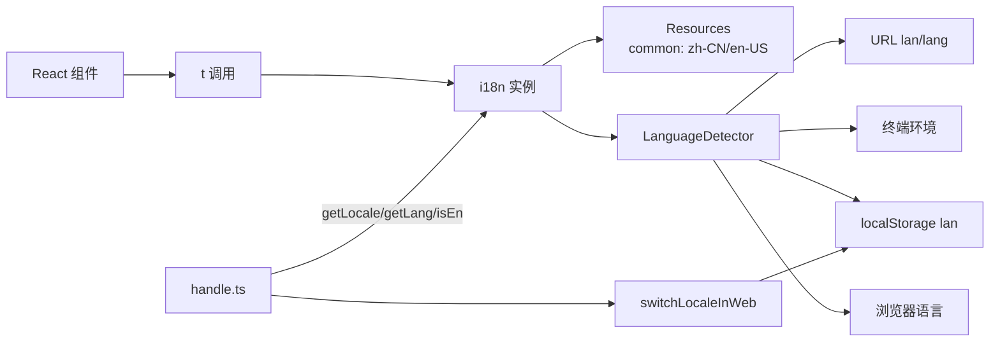

# 国际化设计说明（intl）

## 模块边界
- 负责：语言检测、切换与持久化；翻译资源注册；前端渲染插值策略
- 不负责：后端多语言、翻译内容生产流程

## 架构设计

## 状态与持久化
- 全局状态由 `i18n` 内部维护
- Web 端通过 `localStorage` `lan` 持久化用户选择
- 切换语言后刷新页面，确保资源、组件与状态一致

## 资源组织
- 命名空间：`common`
- 区域：`zh-CN`、`en-US`
- 资源来源：`packages/gel-util/src/intl/locales`（内置）

## 插值策略
- `t` 支持字符串插值与 React 节点占位符插值
- 节点插值通过占位标记拆分与替换，避免 XSS 风险

## 兼容与迁移
- 历史 API `intl`、`tNoNO` 标注为废弃
- 迁移建议：统一改用 `t`，在需要隐藏序号或特殊格式时通过上层逻辑控制

## 可观测性与调试
- 支持调试开关（i18next 的 debug 模式）
- 建议在非生产环境打开调试以观察 key 命中与回退

## 性能与降级
- 资源按语言一次性注册；切换时整体刷新，避免局部状态不一致
- 未找到 key 时应回退到默认值，不阻塞渲染

## 业务规则引用
- 企业名称展示与取值规则：`./company-name.md`
