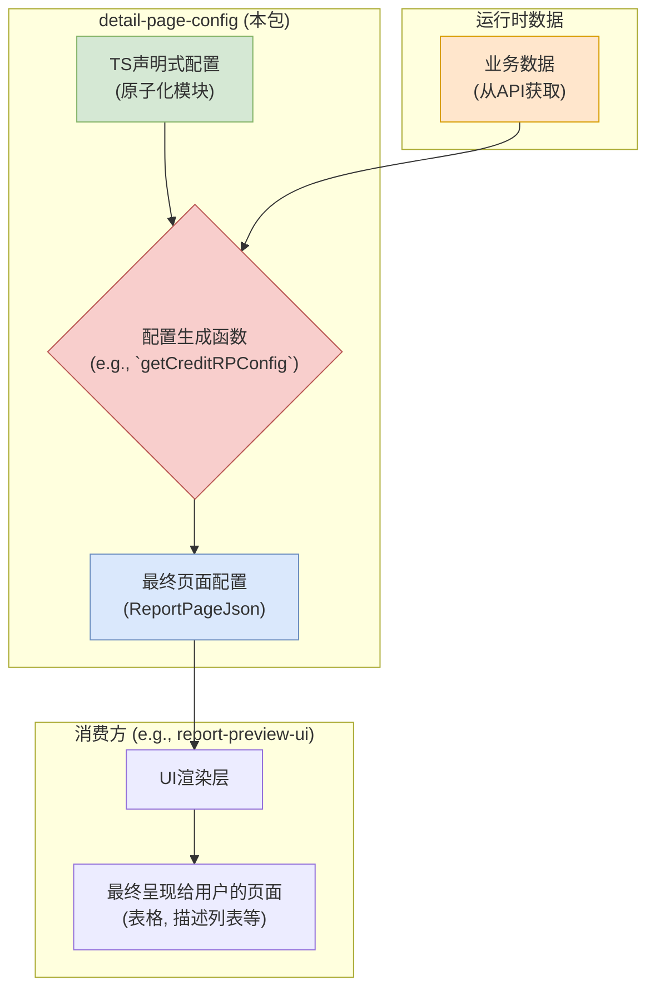

# `detail-page-config` - 详情页配置中心

## 🎯 它是什么？

`detail-page-config` 是一个**配置即代码 (Configuration as Code)** 的中央枢纽。它不产出任何 UI 界面，而是专门用于**生成**驱动复杂详情页（如数据报告、企业主页）UI 渲染的、高度结构化的 **TypeScript 配置对象**。

## 解决的核心问题

在复杂的前端应用中，页面结构和业务规则常常硬编码在 UI 组件中，导致：
- **逻辑耦合**: UI 组件（"如何渲染"）与业务逻辑（"渲染什么"）紧密耦合，难以维护。
- **配置分散**: 相似的配置散落在不同项目中，无法复用，修改困难。
- **动态性差**: 无法根据用户权限、业务数据等动态调整页面结构。

本包通过将**页面结构配置化**，并由一个中央包来统一管理和生成，实现了"渲染内容"与"渲染方式"的彻底分离。

## 核心理念：配置驱动 UI

本包是整个数据驱动UI渲染流程中的"大脑"。它整合**静态的、声明式的模块配置**和**动态的、运行时的业务数据**，最终生成一份精确的、驱动 UI 渲染的蓝图 (`ReportPageJson`)。



## ❗ 核心约束：为 `wkhtmltopdf` 而设计 ❗

**警告：此包是 `report-print` 项目的核心依赖。所有运行时代码最终都在 `wkhtmltopdf` 的老旧 JavaScript 引擎 (约等于 ES5) 中执行。**

这意味着，任何在**运行时**执行的代码（主要是 `helper` 目录下的函数和配置生成函数 `getCreditRPConfig` 内部的逻辑）都必须遵守极其严格的规范：

1.  **禁止使用现代 JS 语法/API**:
    -   严禁使用 **ES6+** 的任何新语法（如 `let`, `const`, `() => {}`, `...spread`）。
    -   严禁使用现代数组/对象方法，如 `Array.prototype.includes`, `Object.values`, `String.prototype.startsWith` 等。
2.  **无 Polyfill 环境**: 必须编写原生、自包含的 ES5 兼容代码。
3.  **强制回归测试**: 对配置生成逻辑的任何修改，都**必须**在 `report-print` 项目中通过 `wkhtmltopdf` 进行完整的回归测试。

> **虽然本包主要提供声明式配置，但其中嵌入的函数逻辑若违反兼容性约束，同样会导致线上报告生成失败。**

## 架构与特性

- **动态与可编程**
    - **配置即函数**: 包的核心导出是 `getCreditRPConfig` 这样的函数，而非静态 JSON。这允许在生成配置时嵌入复杂的业务逻辑。
    - **逻辑封装**: 常见的业务判断被封装为 `helper` 函数，例如：
        - `filterReportConfigByUserInfo`: 根据用户权限移除无权查看的模块。
        - `getShareholderInfoByCorpArea`: 根据企业地区，动态返回适配当地法律的股东信息结构。

- **类型安全与验证**
    - **共享类型**: 依赖 `gel-types` 来保证所有配置对象都有严格的类型定义。
    - **自动同步 Schema**: `src/validation/schema` 目录中的 JSON Schema 是从 `gel-types` 自动生成的，确保验证规则与类型定义永远同步。
    - **无依赖验证器**: `src/validation/validator` 中实现了一个轻量级、无第三方依赖的自定义验证器，可在开发阶段提前发现配置结构错误。

- **模块化与性能**
    - **原子化配置**: 配置被拆分成大量可复用的独立模块（如 `baseInfo`, `businessRisk`)，再由主配置函数 (`creditRP.ts`) 统一组装。
    - **Tree-shaking 优化**: 包的构建已为 Tree-shaking 做好深度优化 (`"sideEffects": false`)。消费方如果只导入 `getCreditRPConfig`，其他不相关的配置（如 `getDDRPConfig`) 就不会被打包，大幅减小最终产物體積。

## 核心数据结构：表格配置 (`ReportDetailTableJson`)

UI 层通过解析配置中的 `type` 字段来决定使用哪种表格渲染器。所有表格的基础是**单元格配置**。

### I. 单元格基础配置 (`ConfigTableCellJsonConfig`)

这是构成所有表格的最小原子，它定义了每一个"单元格"的取值、渲染方式和行为。

| 属性 | 类型 | 描述 |
| :--- | :--- | :--- |
| `label` | `string` | 单元格的标题 (例如，表头名称) |
| `prop` | `string` | 对应数据源 `data` 数组中对象的 `key`，用于自动取值 |
| `renderType` | `string` | **渲染器类型**，告知 UI 使用何种预设组件来渲染 |
| `renderConfig` | `object` | **渲染器配置**，为 `renderType` 提供精细化控制参数 |
| `customRenderName`| `string` | **自定义渲染器名称**，一个"逃生舱"，用于最高优先级的复杂渲染 |

### II. 渲染控制：`renderType` & `renderConfig`

`renderType` 与 `renderConfig` 协同工作，为单元格提供丰富的表现力。

| `renderType` | `renderConfig` 常用属性 | 说明 |
| :--- | :--- | :--- |
| `'text'` | `useThousandSeparator`, `decimalPlaces`, `unit`, `emptyText` | 格式化文本或数字 |
| `'money'` | (同上) | 专门用于货币，语义更清晰 |
| `'date'` | `format` (e.g., 'YYYY-MM-DD') | 格式化日期 |
| `'dateRange'`| `startField`, `endField`, `connector` | 渲染日期范围，例如 "2022-01-01 至 2023-01-01" |
| `'link'` | `target` (e.g., '_blank') | 渲染可点击的超链接 |
| `'tags'` | `tagColors` | 渲染标签组 |
| `'image'` | `imageRenderType` ('brand', 'corp') | 渲染特定类型的 Logo |
| `'html'` | (无) | **谨慎使用**：直接将内容作为 HTML 字符串进行渲染 |

### III. 终极武器：`customRenderName`

这是一个**"逃生舱"机制**，用于处理标准 `renderType` 无法覆盖的、最复杂的渲染逻辑。

- **作用**: `customRenderName` 的值是一个预定义的字符串（如 `'casePartyRenderer'`）。
- **机制**: 消费端 (如 `report-preview-ui`) 内部维护一个从 `customRenderName` 到一个**特定 React 组件**的映射表。当解析到此配置时，UI 层会**忽略 `renderType`**，转而渲染这个强大的自定义组件，并将当前整行数据作为 props 传入。
- **用途**: 适用于需要复杂交互、多字段组合或特殊布局的单元格，例如渲染包含多个链接和状态图标的"案件当事人"信息。


### IV. 三种核心表格类型

#### 1. `ReportVerticalTableJson` (`type: 'verticalTable'`)

- **用途**: 渲染最常见的**标准垂直表格**。即常规的、多行多列、顶部为统一表头的表格。
- **结构**: 其 `columns` 属性是一个一维数组 `ConfigTableCellJsonConfig[]`。
- **渲染效果模拟**:


| 姓名 | 年龄 | 城市 |
| :--- | :--- | :--- |
| 张三 | 30 | 上海 |
| 李四 | 25 | 北京 |


#### 2. `ReportHorizontalTableJson` (`type: 'horizontalTable'`)

- **用途**: 渲染**横向（键值对）样式的表格**。通常用于展示对象详情，即左侧为字段名，右侧为字段值。
- **结构**: 其 `columns` 属性是一个**二维数组** `ConfigTableCellJsonConfig[][]`。每个内部数组代表视觉上的一"行"。
- **渲染效果模拟**:

| 字段名 | 字段值 |
| :--- | :--- |
| **公司名称** | 示例科技有限公司 |
| **成立日期** | 2024-01-01 |
| **注册资本** | 1,000,000 元 |

#### 3. `ReportCrossTableJson` (`type: 'crossTable'`)

- **用途**: 渲染复杂的**交叉表格（或透视表）**，其行和列都可能作为数据的维度，例如财务报表。
- **结构**: 定义了 `firstRowFirstColumnConfig`, `rowHeaders`, `columnHeader`, `cellConfig` 等多个部分来精确描述表格结构。
- **渲染效果模拟**:

| &nbsp; | **2023年度** | **2022年度** |
| :--- | :--- | :--- |
| **总资产** | 1,000,000 | 800,000 |
| **总负债** | 400,000 | 300,000 |

## 技术栈与核心依赖

- **构建工具**: 使用 `Vite` 进行构建。
- **核心依赖**:
    - `gel-types` (内部包): **类型基石**。提供了所有配置对象共享的 TypeScript 类型定义，确保了整个配置系统的类型安全。
- **开发时依赖**:
    - `typescript-json-schema`: 用于在构建时根据 `gel-types` 中的 TypeScript 类型，自动生成 JSON Schema，用于后续的配置验证。
- **设计特点**:
    - **运行时零依赖**: 为了保证在 `wkhtmltopdf` 等极端受限的 JS 环境中稳定运行，本包在编译产物中**不包含任何第三方运行时依赖**。

## 使用方法

此包的正确使用方式是按需从其特定的入口点导入配置生成函数。

```typescript
import { getCreditRPConfig } from 'detail-page-config/corp';
import { someData, someNum, otherInfo, userFlags } from './api';

// 1. 调用配置生成函数，并传入运行时所需的数据
const reportConfig = getCreditRPConfig(someData, someNum, otherInfo, userFlags);

// 2. 将生成的配置传递给 UI 组件进行渲染
// <ReportPreviewComponent config={reportConfig} />
```

这种设计确保了业务逻辑被封装在 `detail-page-config` 内部，而 UI 组件则保持通用和无状态。 