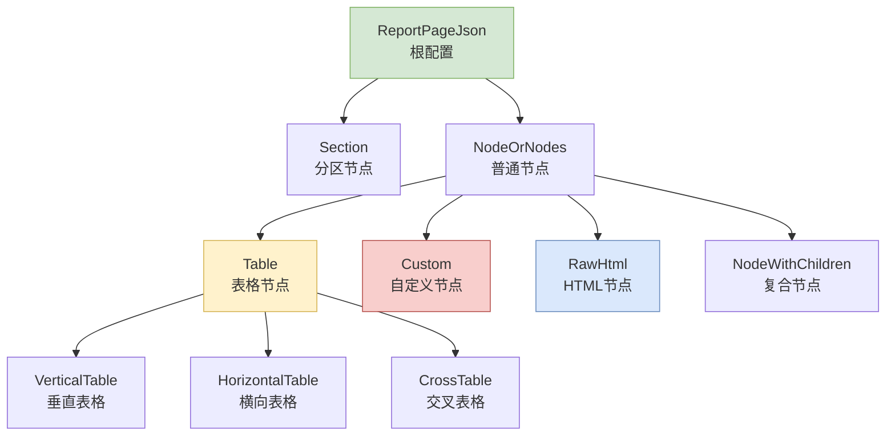
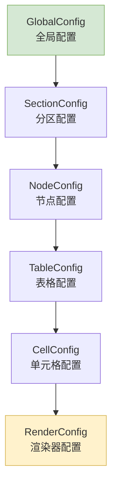

# 节点配置设计详解

## 概览

**功能范围**：企业详情页面节点的配置设计、数据结构和业务逻辑说明。

**目标用户**：
- 前端开发人员：理解节点配置方式和数据结构
- 产品经理：了解节点展示的业务内容

**关键用例**：
1. 配置企业详情页面各模块展示内容
2. 定义数据获取和渲染规则
3. 控制页面交互和权限

## 节点类型体系

### 节点分类职责表

| 节点类型 | 用途 | 配置复杂度 | 数据源要求 |
|----------|------|------------|------------|
| **Section** | 页面级分区，包含子节点 | 中等 | 无 |
| **Table** | 标准表格数据展示 | 中等 | 特定API |
| **Custom** | 复杂业务逻辑特殊节点 | 高 | 多源数据 |
| **RawHtml** | 直接渲染HTML内容 | 低 | HTML字符串 |
| **NodeWithChildren** | 包含多个子节点的容器 | 中等 | 无 |

## 核心节点配置

### 表格节点配置体系

| 表格类型 | 用途场景 | 数据特点 | 配置要点 |
|----------|----------|----------|----------|
| **VerticalTable** | 标准多行多列表格 | 列表数据 | 分页、排序、筛选 |
| **HorizontalTable** | 键值对样式表格 | 对象详情 | 多列布局、字段展示 |
| **CrossTable** | 交叉分析表格 | 多维数据 | 聚合计算、交叉分析 |

### 单元格渲染器类型

| renderType | 适用数据 | 典型场景 | 配置要点 |
|------------|----------|----------|----------|
| `text` | 字符串、数字 | 基础文本展示 | 格式化、长度限制 |
| `money` | 数字 | 金额字段 | 货币符号、精度控制 |
| `date` | 日期字符串 | 时间字段 | 格式化、时区设置 |
| `link` | URL字符串 | 可点击链接 | 打开方式、外部链接 |
| `tags` | 数组 | 标签展示 | 颜色方案、展开控制 |
| `image` | 图片URL | 图片展示 | 尺寸控制、预览功能 |
| `custom` | 任意类型 | 自定义逻辑 | 组件映射、数据传递 |

### 自定义节点核心配置

| 节点类型 | 业务场景 | 数据复杂度 | 组件要求 |
|----------|----------|------------|----------|
| **股权穿透图谱** | 投资关系分析 | 多层股权关系 | 图谱可视化 |
| **集团体系** | 关联企业展示 | 企业网络关系 | 网络图展示 |
| **实际控制人** | 控制链分析 | 控制权追溯 | 层级关系图 |
| **竞争对手** | 市场分析 | 对比数据 | 竞争分析图表 |

## 配置继承与验证

### 配置继承层次

### 配置覆盖规则

1. **子配置覆盖父配置**：具体配置优先于通用配置
2. **后配置覆盖前配置**：相同字段后定义的生效
3. **类型化配置优先**：特定类型配置优先于通用配置
4. **用户配置最高优先级**：用户自定义配置覆盖系统默认

### 错误处理策略

| 错误类型 | 处理方式 | 用户提示 | 恢复机制 |
|----------|----------|----------|----------|
| **配置格式错误** | 抛出异常 | 配置格式不正确 | 检查配置文件 |
| **API调用失败** | 显示重试按钮 | 数据加载失败 | 自动重试机制 |
| **数据格式异常** | 使用默认配置 | 数据格式异常 | 降级显示 |
| **渲染器缺失** | 显示原始数据 | 渲染器不可用 | 使用默认渲染器 |

## 性能优化配置

### 核心优化策略

| 优化维度 | 配置项 | 实现方式 | 效果 |
|----------|--------|----------|------|
| **数据加载** | 懒加载 | 可见时加载 | 减少初始请求 |
| **缓存策略** | 缓存配置 | TTL控制 | 减少重复请求 |
| **渲染性能** | 虚拟化 | 大列表优化 | 提升渲染速度 |
| **内存管理** | 组件卸载清理 | 及时清理资源 | 避免内存泄漏 |

## 地区差异化节点

### 特殊配置节点

| 节点名称 | 适用地区 | 特殊处理 | 数据源差异 |
|----------|----------|----------|------------|
| **HKCorpInfo** | 香港企业 | 公司注册处查询 | 香港公司API |
| **英国股东信息** | 英国企业 | Companies House查询 | 英国公司API |
| **印度股东信息** | 印度企业 | MCA Portal查询 | 印度公司API |
| **泰国股东信息** | 泰国企业 | DBD注册查询 | 泰国公司API |

## 相关文档

- @see ./data-structures.md - 核心数据结构说明
- @see ./validation-design.md - 类型校验系统设计
- @see ./custom-nodes-complete-list.md - 自定义节点完整列表
- @see ../README.md - 包概述和快速开始
- @see ../../types/src/ConfigDetail/report/index.ts - 类型定义文件