# AI Chat 智能对话组件

> 提供完整AI对话能力的UI组件库，支持流式响应、多轮对话、角色定制等核心功能。

## 📁 目录结构

```
ai-chat/
├── requirements/           # 需求规格文档
│   ├── functional-requirements.md  # 功能需求规格
│   └── user-experience.md         # 用户体验设计
├── design/               # 技术设计文档
│   ├── architecture-design.md     # 系统架构设计
│   ├── message-model-design.md    # 消息模型设计
│   └── rendering-system-design.md # 渲染系统设计
├── guides/              # 实施指南
│   ├── integration-guide.md       # 集成指南
│   └── troubleshooting.md        # 问题排查
└── README.md            # 文档导航（当前文件）
```

## 🎯 核心能力

- **流式对话**: 实时流式响应，支持中断和恢复
- **多轮管理**: 完整的对话历史管理和上下文保持
- **角色系统**: 可配置的AI角色显示和交互
- **数据增强**: RPU/RAG数据展示和建议交互
- **渲染引擎**: 完整的Markdown渲染和源码追溯

## 🚀 快速开始

### 面向角色阅读路径

| 角色 | 推荐阅读路径 | 目标 |
|------|-------------|------|
| **产品经理** | README → functional-requirements → user-experience | 了解功能边界和用户体验 |
| **开发工程师** | README → architecture-design → integration-guide → message-model-design | 掌握架构和集成方法 |
| **UI/UX设计师** | README → user-experience → rendering-system-design | 理解交互设计和视觉实现 |
| **测试工程师** | README → functional-requirements → troubleshooting | 明确测试范围和问题排查 |

### 技术栈依赖

```mermaid
graph TD
    A[AI Chat Components] --> B[gel-util]
    A --> C[gel-api]
    A --> D[React 18+]
    A --> E[ahooks]
    A --> F[classnames]

    B --> G[消息解析工具]
    C --> H[AI请求接口]
    D --> I[组件生命周期]
    E --> J[状态管理]
    F --> K[样式处理]
```



## 📊 模块架构

```mermaid
graph TB
    subgraph "UI层"
        A1[ChatMessage] --> A2[ChatRoles]
        A2 --> A3[Suggestion]
        A3 --> A4[Conversation]
        A4 --> A5[Welcome]
    end

    subgraph "服务层"
        B1[agentRequest] --> B2[Core Operations]
        B2 --> B3[Analysis Engine]
    end

    subgraph "状态层"
        C1[useAIChatSendState] --> C2[useCancelChatRequest]
        C2 --> C3[useChatSessionControl]
    end

    subgraph "工具层"
        D1[messageParser] --> D2[messageRestore]
        D2 --> D3[TypeScript Types]
    end

    A1 --> B1
    B1 --> C1
    C1 --> D1
```



## 🔗 实现映射

| 文档 | 实现路径 | 核心文件 |
|------|----------|----------|
| functional-requirements | `src/biz/ai-chat/` | ChatMessage, ChatRoles |
| architecture-design | `src/service/ai-chat/` | agentRequest, Core |
| message-model-design | `src/types/ai-chat/` | message types, sender types |
| rendering-system-design | `src/utils/ai-chat/` | messageParser, rendering |

## 📋 相关文档

- **设计规范**: [前端设计文档编写规范](../../../../docs/rule/design-doc.md)
- **需求规范**: [需求文档编写规范](../../../../docs/rule/require-doc.md)
- **文档规范**: [文档编写规范](../../../../docs/rule/documentation-rule.md)
- **README规范**: [README文档编写规范](../../../../docs/rule/readme-rule.md)

## ⚡ 快速参考

| 需求场景 | 对应文档 | 关键实现 |
|----------|----------|----------|
| 新功能开发 | functional-requirements + architecture-design | src/biz/ + src/service/ |
| 样式定制 | rendering-system-design | src/components/styles/ |
| 性能优化 | architecture-design + integration-guide | src/hooks/ + src/utils/ |
| 问题排查 | troubleshooting | 错误边界 + 日志系统 |

---

*最后更新: 2025-11-03 | 版本: v2.0*
