# AI 回答文本渲染系统设计文档（布局与功能）

## 🧭 设计概览

- **功能范围与边界**：AI 生成回答的完整渲染处理系统，涵盖溯源标记、实体识别链接化、模型类型标识等核心功能。从 AI 原始响应到用户可见的富文本展示的完整链路。
- **目标用户**：
  - 最终用户：查看 AI 回答、点击溯源标记、访问实体详情
  - 前端开发者：集成 AI 回答渲染功能、扩展渲染逻辑
  - 后端开发者：理解前端对 AI 响应数据的处理方式
- **使用场景**：
  - AI 聊天界面：实时流式渲染回答，展示溯源标记和实体链接
  - 报告编辑器（TinyMCE）：以不可编辑形式展示溯源标记
  - 复制分享：清除所有标记，导出纯文本
  - 历史会话查看：渲染历史回答内容
- **关键用例**：
  1. AI 回答 "小米科技营收增长20%" → 自动添加溯源【0(10~20)】+ 实体链接[小米科技](ner:company:123)
  2. 同一段落多处引用 → 合并为单个标记【0(10~20，30~40)】
  3. 点击实体链接 → 跳转到公司详情页
  4. 点击溯源标记 → 高亮参考资料对应位置
  5. 复制回答 → 自动清除标记和链接，保留纯文本
  6. TinyMCE 编辑器 → 溯源标记不可编辑，保持完整性

## 🗺 信息架构与导航

### 完整渲染流程架构

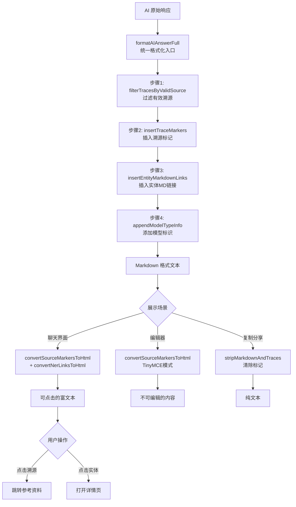

### 模块依赖关系

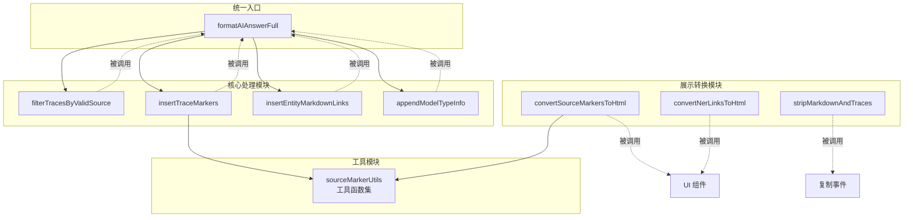

### 数据流向时序图

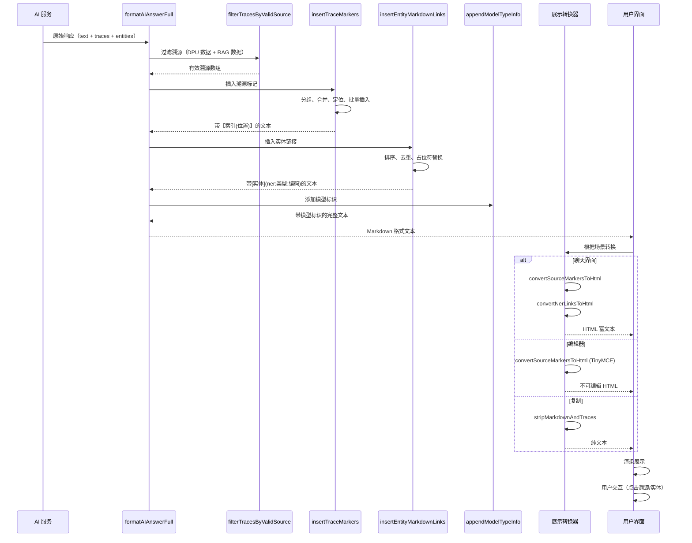

### 入口与使用映射

| 入口函数                   | 使用场景     | 输入          | 输出          | 调用时机   |
| -------------------------- | ------------ | ------------- | ------------- | ---------- |
| formatAIAnswerFull         | AI 回答生成  | 原始响应数据  | Markdown 文本 | 流式完成后 |
| convertSourceMarkersToHtml | 展示到UI     | Markdown 文本 | HTML (span)   | 渲染前     |
| convertNerLinksToHtml      | 展示实体链接 | Markdown 文本 | HTML (a 标签) | 渲染前     |
| stripMarkdownAndTraces     | 复制/导出    | Markdown 文本 | 纯文本        | 复制事件   |
| filterTracesByValidSource  | 溯源过滤     | 全部溯源      | 有效溯源      | 格式化前   |

## 🧱 功能蓝图（逐功能）

### 模块1：统一格式化入口（formatAIAnswerFull）

#### 目标与完成标准

作为 AI 回答处理的统一入口，按序执行所有格式化操作，生成包含溯源标记、实体链接和模型标识的 Markdown 文本。

#### 处理流程图

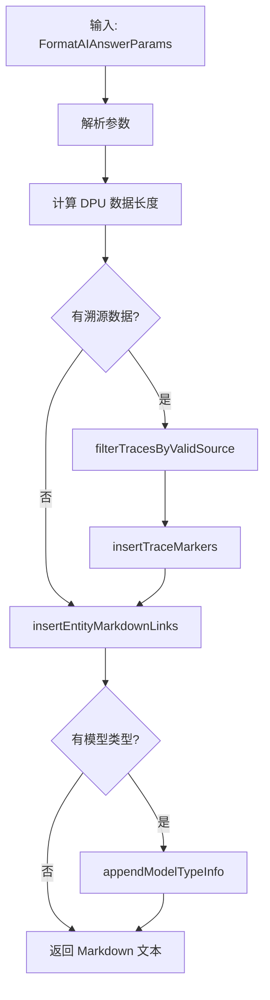

#### 参数说明表

| 参数         | 类型                  | 必填 | 默认值    | 说明                     |
| ------------ | --------------------- | ---- | --------- | ------------------------ |
| answers      | string                | 是   | -         | AI 原始回答文本          |
| traceContent | ChatTraceItem[]       | 否   | undefined | 溯源标记列表             |
| content      | ChatDPUResponse       | 否   | undefined | DPU 数据                 |
| suggest      | ChatRAGResponse       | 否   | undefined | RAG 数据                 |
| entity       | ChatEntityRecognize[] | 否   | undefined | 实体识别结果             |
| modelType    | EModelType            | 否   | undefined | 模型类型（GPT/Claude等） |

#### 处理规则表

| 步骤        | 条件              | 操作                           | 结果                             |
| ----------- | ----------------- | ------------------------------ | -------------------------------- |
| 1. 过滤溯源 | traceContent 存在 | 调用 filterTracesByValidSource | 仅保留 DPU 数据和有效类型的溯源  |
| 2. 插入溯源 | 过滤后有溯源      | 调用 insertTraceMarkers        | 文本末尾添加【索引(位置)】       |
| 3. 插入实体 | entity 存在       | 调用 insertEntityMarkdownLinks | 实体替换为 [名称](ner:类型:编码) |
| 4. 添加模型 | modelType 存在    | 调用 appendModelTypeInfo       | 末尾添加 "回答使用模型: XXX"     |

### 模块2：溯源有效性过滤（filterTracesByValidSource）

#### 目标与完成标准

过滤溯源标记，仅保留来自 DPU 数据和有效 RAG 数据类型的溯源，确保用户点击溯源时能找到对应的来源。

#### 处理流程图

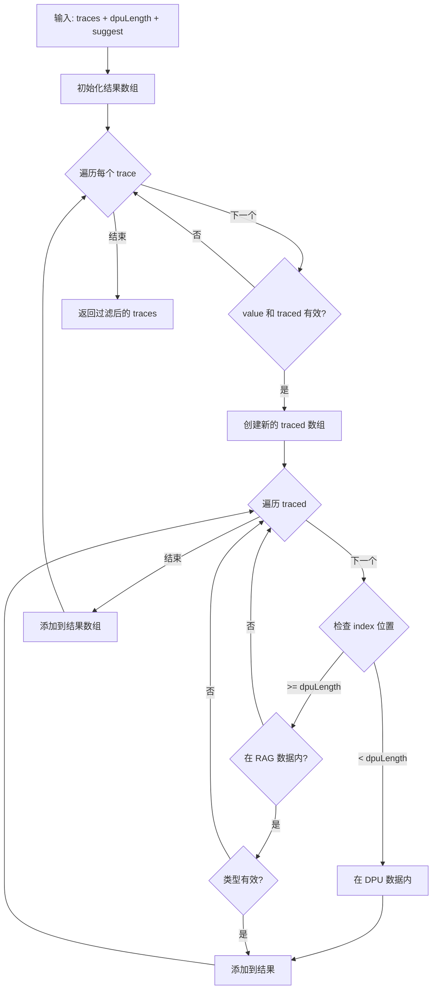

#### 有效来源类型

| 类型代码 | 说明       | 是否保留 |
| -------- | ---------- | -------- |
| RN       | 研报（新） | ✅ 是    |
| N        | 新闻       | ✅ 是    |
| R        | 研报       | ✅ 是    |
| A        | 公告       | ✅ 是    |
| L        | 法律文书   | ✅ 是    |
| YQ       | 舆情       | ✅ 是    |
| 其他     | 未定义类型 | ❌ 否    |

#### 过滤逻辑表

| 条件       | index 范围                              | 判断逻辑                             | 结果           |
| ---------- | --------------------------------------- | ------------------------------------ | -------------- |
| DPU 数据内 | [0, dpuLength)                          | 无条件保留                           | 保留           |
| RAG 数据内 | [dpuLength, dpuLength + suggest.length) | 检查 suggest[index - dpuLength].type | 类型有效则保留 |
| 超出范围   | >= dpuLength + suggest.length           | 跳过                                 | 丢弃           |

### 模块3：溯源标记插入（insertTraceMarkers）

#### 目标与完成标准

将溯源信息插入到文本段落末尾，格式为【索引(位置范围)】。同一段落、同一索引的多个位置合并到一个标记中。

#### 处理流程图

```mermaid
flowchart TD
  Start[输入: text + traces] --> Valid{数据有效?}
  Valid -->|否| Return[返回原文]
  Valid -->|是| Stage1[阶段1: 数据分组]

  Stage1 --> GroupByIndex[按 index 分组]
  GroupByIndex --> GroupByPara[同段落同索引合并]
  GroupByPara --> Stage2[阶段2: 定位插入位置]

  Stage2 --> FindValue[查找 value 在 text 中的位置]
  FindValue --> FindEnd[查找段落结束位置]
  FindEnd --> CheckTable{包含表格?}

  CheckTable -->|是| BeforePipe[在最后一个 | 之前插入]
  CheckTable -->|否| AtEnd[在段落末尾插入]

  BeforePipe --> Stage3[阶段3: 生成标记]
  AtEnd --> Stage3

  Stage3 --> Normalize[位置排序去重]
  Normalize --> BuildMarker[buildSourceMarker]
  BuildMarker --> Stage4[阶段4: 批量插入]

  Stage4 --> SortDesc[按位置降序排列]
  SortDesc --> InsertLoop[从后向前插入]
  InsertLoop --> Result[返回最终文本]
```

#### 四个阶段详解

| 阶段        | 输入             | 操作                                        | 输出               | 目的         |
| ----------- | ---------------- | ------------------------------------------- | ------------------ | ------------ |
| 1. 数据分组 | traces 数组      | 按 index 分组，判断同段落，合并 positions   | tracesByIndex 对象 | 避免重复标记 |
| 2. 定位位置 | value, text      | 找到 value 位置，计算段落末尾，表格特殊处理 | insertPoints 数组  | 确定插入位置 |
| 3. 生成标记 | index, positions | 排序去重，格式化为【索引(位置)】            | 标记字符串         | 生成最终标记 |
| 4. 批量插入 | insertPoints     | 降序排列，从后向前替换                      | 最终文本           | 避免位置偏移 |

#### 边界条件处理

| 边界情况            | 处理策略               | 原因               |
| ------------------- | ---------------------- | ------------------ |
| text 或 traces 为空 | 直接返回原文           | 无需处理           |
| value 不存在于 text | 跳过该溯源点           | 数据异常，避免错误 |
| value 以 \n\n 结尾  | 在 \n\n 之前插入       | 保持段落结构       |
| 找不到段落分隔符    | 在 text.length 插入    | 最后一段           |
| 包含 Markdown 表格  | 在最后一个 \| 之前插入 | 保持表格完整性     |

### 模块4：实体 Markdown 链接化（insertEntityMarkdownLinks）

#### 目标与完成标准

将文本中的实体（公司、人物等）转换为 Markdown 链接格式 `[实体名称](ner:类型:编码)`，便于后续转换为可点击的 HTML 链接。

#### 处理流程图

```mermaid
flowchart TD
  Start[输入: text + entities] --> Valid{有实体数据?}
  Valid -->|否| Return[返回原文]
  Valid -->|是| Sort[按 key 长度降序排序]

  Sort --> Unique[去重（相同 key 保留第一个）]
  Unique --> Phase1[第一阶段: 替换为占位符]

  Phase1 --> Loop1{遍历实体}
  Loop1 -->|下一个| Escape[转义正则特殊字符]
  Escape --> Replace1[全局替换为 __ENTITY_N__]
  Replace1 --> Record[记录占位符映射]
  Record --> Loop1
  Loop1 -->|结束| Phase2[第二阶段: 还原为链接]

  Phase2 --> Loop2{遍历占位符}
  Loop2 -->|下一个| GenLink[生成 [text]\(ner:type:code\)]
  GenLink --> Replace2[替换占位符]
  Replace2 --> Loop2
  Loop2 -->|结束| Output[返回最终文本]
```

#### 关键算法说明

**为什么按长度降序排序？**
避免短实体误匹配长实体的一部分。

| 场景                       | 不排序的问题                                        | 排序后的结果                                    |
| -------------------------- | --------------------------------------------------- | ----------------------------------------------- |
| 文本: "小米科技和小米集团" | 先匹配 "小米" → "[小米](...)科技和[小米](...) 集团" | 先匹配 "小米科技" → "[小米科技](...)和小米集团" |
| 实体: ["小米", "小米科技"] | 长实体被破坏                                        | 长实体优先，短实体仅匹配剩余部分                |

**为什么使用占位符机制？**
避免嵌套替换和正则冲突。

| 阶段     | 文本变化                          | 说明                             |
| -------- | --------------------------------- | -------------------------------- |
| 原始     | "小米科技成立"                    | -                                |
| 第一阶段 | "**ENTITY_0**成立"                | 占位符不含特殊字符，不会被误匹配 |
| 第二阶段 | "[小米科技](ner:company:123)成立" | 安全替换为最终链接               |

#### 实体识别数据结构

| 字段 | 类型   | 必填 | 说明                           | 示例                   |
| ---- | ------ | ---- | ------------------------------ | ---------------------- |
| key  | string | 是   | 匹配关键词（用于在文本中查找） | "小米科技有限责任公司" |
| name | string | 是   | 实体名称（显示文本）           | "小米科技有限责任公司" |
| code | string | 是   | 实体编码（生成链接 URL）       | "1047934153"           |
| type | string | 否   | 实体类型（默认 company）       | "company" / "person"   |

### 模块5：溯源标记转换为 HTML（convertSourceMarkersToHtml）

#### 目标与完成标准

将 Markdown 格式的溯源标记【3(181~223)】转换为带 data 属性的 HTML span 标签，支持不同展示场景。

#### 处理流程图

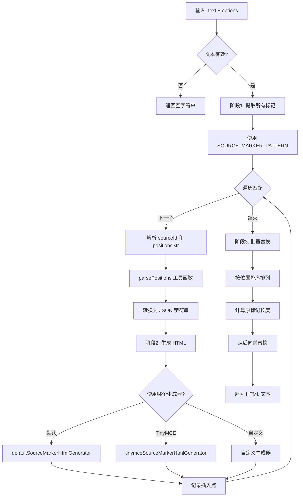

#### 生成器对比表

| 生成器类型     | 生成的 HTML                                                                               | 适用场景       | 关键属性           |
| -------------- | ----------------------------------------------------------------------------------------- | -------------- | ------------------ |
| 默认生成器     | `<span class="source-marker" data-source-id="3" data-positions='[...]'>[3]</span>`        | AI 聊天界面    | 可点击、带完整数据 |
| TinyMCE 生成器 | `<span class="source-marker" data-mce-bogus="all" contenteditable="false" ...>[3]</span>` | TinyMCE 编辑器 | 不可编辑、防删除   |
| 自定义生成器   | 用户自定义格式                                                                            | 特殊业务场景   | 完全可控           |

#### HTML 属性详解

| 属性名          | 类型        | 作用                       | 示例值                          | 前端使用                   |
| --------------- | ----------- | -------------------------- | ------------------------------- | -------------------------- |
| data-source-id  | string      | RAG 数据索引               | "3"                             | 点击时定位到第3个 RAG 数据 |
| data-positions  | JSON string | 位置范围数组               | '[{"start":"181","end":"223"}]' | 高亮 RAG 数据的181-223字符 |
| class           | string      | CSS 类名（样式与点击事件） | "source-marker"                 | 应用溯源标记样式           |
| contenteditable | boolean     | TinyMCE 可编辑性           | false                           | 禁止用户编辑标记           |
| data-mce-bogus  | string      | TinyMCE 特殊标记           | "all"                           | 编辑器内部标识             |

### 模块6：NER 链接转换为 HTML（convertNerLinksToHtml）

#### 目标与完成标准

将 Markdown 格式的实体链接 `[小米科技](ner:company:123)` 转换为真实的 HTML `<a>` 标签，指向公司详情页。

#### 处理流程图

```mermaid
flowchart TD
  Start[输入: text + isDev] --> Regex[正则匹配 NER 链接]

  Regex --> Loop{遍历匹配}
  Loop -->|下一个| Extract[提取 entityName, entityType, entityCode]
  Extract --> GenURL[generateUrlByModule 生成 URL]
  GenURL --> CheckEnv{运行环境?}

  CheckEnv -->|客户端| TargetSelf[target="_self"]
  CheckEnv -->|浏览器| TargetBlank[target="_blank"]

  TargetSelf --> BuildHTML[构建 a 标签]
  TargetBlank --> BuildHTML

  BuildHTML --> Replace[替换原链接]
  Replace --> Loop
  Loop -->|结束| Output[返回 HTML 文本]
```

#### NER 链接格式

| 格式部分     | 说明                         | 示例                                             |
| ------------ | ---------------------------- | ------------------------------------------------ |
| `[实体名称]` | 显示文本                     | `[小米科技有限责任公司]`                         |
| `(ner:`      | 固定前缀                     | `(ner:`                                          |
| `类型:`      | 实体类型（company/person等） | `company:`                                       |
| `编码)`      | 实体唯一标识                 | `1047934153)`                                    |
| 完整示例     | -                            | `[小米科技有限责任公司](ner:company:1047934153)` |

#### 生成的 HTML 结构

```html
<a
  href="https://gel.wind.com.cn/web/Company/Company.html?companycode=1047934153&from=openBu3#/"
  target="_blank"
  data-companycode="1047934153"
>
  小米科技有限责任公司
</a>
```

#### 环境适配规则

| 运行环境             | target 属性 | 原因                       | 判断方式          |
| -------------------- | ----------- | -------------------------- | ----------------- |
| 客户端（Electron等） | \_self      | 避免打开冗余空白页面       | `usedInClient()`  |
| 浏览器（Web）        | \_blank     | 新标签打开，不影响当前页面 | `!usedInClient()` |

### 模块7：添加模型类型标识（appendModelTypeInfo）

#### 目标与完成标准

在回答内容末尾添加 "回答使用模型: {modelType}" 的提示信息，告知用户当前回答所使用的 AI 模型。

#### 处理流程图

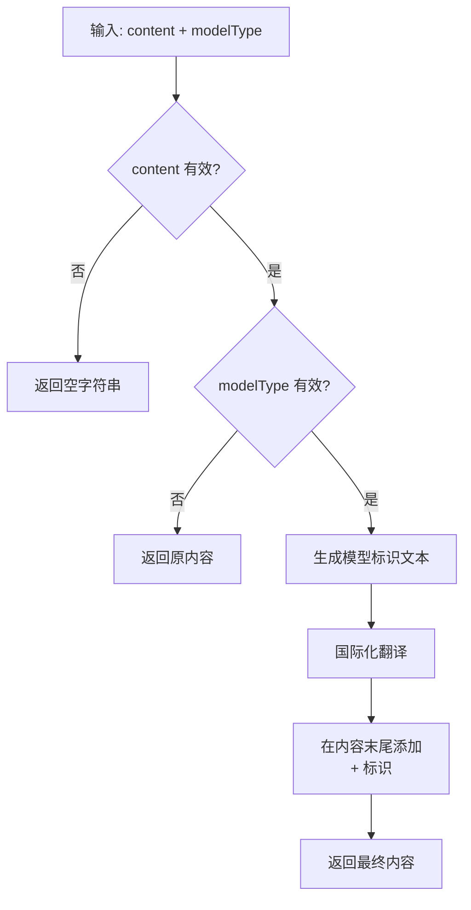

#### 模型类型枚举

| 模型类型 | 枚举值            | 显示文本     | 说明                  |
| -------- | ----------------- | ------------ | --------------------- |
| GPT      | EModelType.GPT    | "GPT"        | OpenAI GPT 系列       |
| Claude   | EModelType.Claude | "Claude"     | Anthropic Claude 系列 |
| 其他     | -                 | 对应的枚举值 | 可扩展                |

#### 输出格式

| 场景       | 输入 modelType | 输出                        |
| ---------- | -------------- | --------------------------- |
| 有模型类型 | EModelType.GPT | "原内容\n回答使用模型: GPT" |
| 无模型类型 | undefined      | "原内容"（不变）            |

### 模块8：清除标记（stripMarkdownAndTraces）

#### 目标与完成标准

移除文本中的所有溯源标记和 Markdown 链接，还原为纯文本，用于复制、分享、导出等场景。

#### 处理流程图

```mermaid
flowchart TD
  Start[输入: text] --> Valid{文本有效?}
  Valid -->|否| Return[返回空字符串]
  Valid -->|是| RemoveLink[移除 Markdown 链接]

  RemoveLink --> LinkRegex[正则: /\[([^\]]+)\]\([^)]+\)/g]
  LinkRegex --> ReplaceLink[替换为 $1（保留文本部分）]

  ReplaceLink --> RemoveTrace[移除溯源标记]
  RemoveTrace --> TraceRegex[正则: /【(\d+)\(([\d~,，]+?)\)】/g]
  TraceRegex --> ReplaceTrace[替换为空字符串]

  ReplaceTrace --> Output[返回纯文本]
```

#### 清除规则表

| 原始格式      | 正则表达式                     | 替换结果           | 示例                                               |
| ------------- | ------------------------------ | ------------------ | -------------------------------------------------- |
| Markdown 链接 | `/\[([^\]]+)\]\([^)]+\)/g`     | 保留文本部分（$1） | `[小米科技](ner:company:123)` → `小米科技`         |
| 溯源标记      | `/【(\d+)\(([\d~,，]+?)\)】/g` | 删除               | `【3(181~223)】` → 空                              |
| 组合示例      | -                              | 两步处理           | `[小米](...)营收增长【0(10~20)】` → `小米营收增长` |

## 🔄 交互流程与状态

### 完整端到端流程

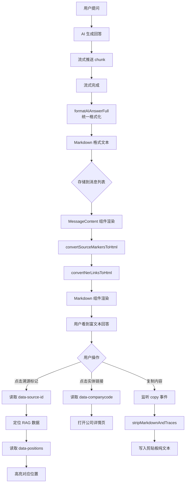

### 渲染状态机

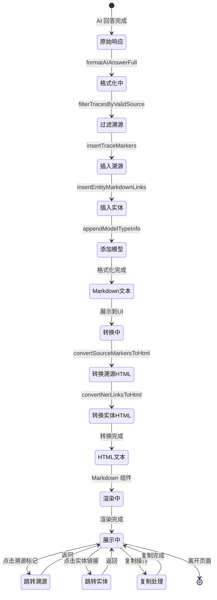

### 用户交互规则表

| 触发条件         | 系统行为                              | 用户反馈                 | 可撤销         | 备注                    |
| ---------------- | ------------------------------------- | ------------------------ | -------------- | ----------------------- |
| AI 回答生成完成  | 自动格式化（全流程）                  | 无感知（后台处理）       | 否             | 100ms 内完成            |
| 渲染到聊天界面   | 转换为 HTML 富文本                    | 看到溯源标记和实体链接   | 否             | 自动转换                |
| 点击溯源标记 [N] | 读取 data-source-id 和 data-positions | 参考资料面板高亮对应位置 | 是（关闭面板） | 支持多个位置            |
| 点击实体链接     | 读取 data-companycode 并跳转          | 新标签打开公司详情页     | 是（关闭标签） | 客户端用 \_self         |
| 悬停溯源标记     | 显示 tooltip                          | 提示 "来源：参考资料N"   | -              | 可选功能                |
| 悬停实体链接     | 显示 tooltip                          | 提示实体类型和编码       | -              | 可选功能                |
| 复制回答内容     | 调用 stripMarkdownAndTraces           | 剪贴板只有纯文本         | 否             | 自动清理                |
| TinyMCE 编辑     | 溯源标记不可编辑                      | 无法删除标记             | -              | contenteditable="false" |

## 🧮 数据与本地状态

### 核心数据流转图

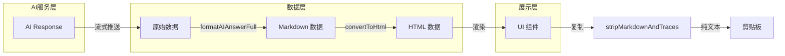

### 输入数据结构（AI 响应）

| 数据项                | 类型                  | 来源            | 必填 | 说明                                |
| --------------------- | --------------------- | --------------- | ---- | ----------------------------------- |
| answers               | string                | AI 流式响应     | 是   | 原始回答文本                        |
| traceContent          | ChatTraceItem[]       | AI traced 字段  | 否   | 溯源信息数组                        |
| traceContent[].value  | string                | AI traced       | 是   | 溯源的原文片段（用于定位段落）      |
| traceContent[].traced | TracedPoint[]         | AI traced       | 是   | 溯源位置信息数组                    |
| traced[].start        | number                | AI traced       | 是   | 在 RAG 数据中的起始位置（字符索引） |
| traced[].end          | number                | AI traced       | 是   | 在 RAG 数据中的结束位置（字符索引） |
| traced[].index        | number                | AI traced       | 是   | RAG 数据索引（0~n）                 |
| content               | ChatDPUResponse       | AI content 字段 | 否   | DPU 数据                            |
| content.data          | any[]                 | AI content      | 是   | DPU 数据数组                        |
| suggest               | ChatRAGResponse       | AI suggest 字段 | 否   | RAG 数据                            |
| suggest.items         | RAGItem[]             | AI suggest      | 是   | RAG 数据数组                        |
| suggest.items[].type  | string                | AI suggest      | 是   | RAG 数据类型（RN/N/R/A/L/YQ等）     |
| entity                | ChatEntityRecognize[] | AI entity 字段  | 否   | 实体识别结果数组                    |
| entity[].key          | string                | AI entity       | 是   | 实体关键词（用于匹配）              |
| entity[].name         | string                | AI entity       | 是   | 实体名称（显示）                    |
| entity[].code         | string                | AI entity       | 是   | 实体编码（生成链接）                |
| entity[].type         | string                | AI entity       | 否   | 实体类型（默认 company）            |
| modelType             | EModelType            | AI metadata     | 否   | 使用的模型类型（GPT/Claude等）      |

### 中间数据结构

| 数据项              | 类型                         | 生命周期                        | 说明                 |
| ------------------- | ---------------------------- | ------------------------------- | -------------------- |
| tracesByIndex       | Record<number, TraceGroup[]> | insertTraceMarkers 内部         | 按索引分组的溯源数据 |
| insertPoints        | InsertPoint[]                | insertTraceMarkers 内部         | 待插入的标记位置数组 |
| normalizedPositions | SourcePosition[]             | insertTraceMarkers 内部         | 排序去重后的位置数组 |
| markerLengths       | Map<number, number>          | convertSourceMarkersToHtml 内部 | 标记原始长度映射     |
| placeholders        | Map<string, EntityInfo>      | insertEntityMarkdownLinks 内部  | 实体占位符映射表     |
| filteredTraces      | ChatTraceItem[]              | formatAIAnswerFull 内部         | 过滤后的有效溯源     |

### 输出数据结构

| 数据项        | 类型   | 消费方                                            | 说明                                              |
| ------------- | ------ | ------------------------------------------------- | ------------------------------------------------- |
| Markdown 文本 | string | convertSourceMarkersToHtml, convertNerLinksToHtml | 包含【索引(位置)】和 [实体](ner:类型:编码) 的文本 |
| HTML 富文本   | string | UI 组件（Markdown 渲染器）                        | 包含 span 和 a 标签的 HTML                        |
| 纯文本        | string | 剪贴板                                            | 清除所有标记和链接后的文本                        |

### 数据处理规则汇总

| 规则类别   | 规则描述                                   | 应用场景                                       | 作用           |
| ---------- | ------------------------------------------ | ---------------------------------------------- | -------------- |
| 溯源过滤   | 仅保留 DPU 数据和有效类型 RAG 数据的溯源   | filterTracesByValidSource                      | 确保溯源可跳转 |
| 位置合并   | 同一段落、同一索引的多个位置合并到一个标记 | insertTraceMarkers                             | 避免重复标记   |
| 位置排序   | 位置按 start 升序排列                      | insertTraceMarkers                             | 标准化输出     |
| 位置去重   | 相同的 start 和 end 只保留一个             | insertTraceMarkers                             | 避免冗余数据   |
| 插入顺序   | 从后向前插入标记                           | insertTraceMarkers, convertSourceMarkersToHtml | 避免位置偏移   |
| 段落定位   | 使用 \n\n 作为段落分隔符                   | insertTraceMarkers                             | 统一段落规则   |
| 表格识别   | 通过 /\|.\*\|/ 正则识别表格行              | insertTraceMarkers                             | 特殊处理       |
| 实体排序   | 按 key 长度降序排列                        | insertEntityMarkdownLinks                      | 长实体优先匹配 |
| 实体去重   | 相同 key 只保留第一个                      | insertEntityMarkdownLinks                      | 避免冲突       |
| 占位符替换 | 先替换为占位符，再还原为链接               | insertEntityMarkdownLinks                      | 避免嵌套替换   |

## 🧩 组件分解与复用

### 完整模块依赖图

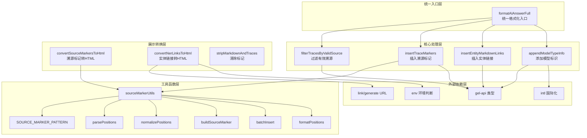

### 函数职责边界表

| 函数                       | 输入                       | 输出            | 职责                                 | 不负责                           |
| -------------------------- | -------------------------- | --------------- | ------------------------------------ | -------------------------------- |
| formatAIAnswerFull         | FormatAIAnswerParams       | Markdown 文本   | 统一格式化入口，组合调用所有处理函数 | 不处理 HTML 转换，不处理展示逻辑 |
| filterTracesByValidSource  | traces, dpuLength, suggest | 过滤后的 traces | 过滤无效溯源（类型判断）             | 不修改 traces 结构，不插入标记   |
| insertTraceMarkers         | text, traces               | 带标记文本      | 插入溯源标记到段落末尾               | 不生成 HTML，不做展示            |
| insertEntityMarkdownLinks  | text, entities             | 带实体链接文本  | 将实体转换为 Markdown 链接           | 不生成 HTML，不跳转              |
| appendModelTypeInfo        | content, modelType         | 带模型标识文本  | 在末尾添加模型类型信息               | 不处理国际化具体逻辑             |
| convertSourceMarkersToHtml | text, options              | HTML 文本       | 将溯源标记转换为 HTML span           | 不处理点击事件，不跳转           |
| convertNerLinksToHtml      | text, isDev                | HTML 文本       | 将 NER 链接转换为 HTML a 标签        | 不处理点击事件，不生成 URL       |
| stripMarkdownAndTraces     | text                       | 纯文本          | 清除标记和链接                       | 不处理复制事件，不操作剪贴板     |

### 工具函数复用表

| 工具函数              | 复用场景                                       | 共享数据格式                        | 作用             |
| --------------------- | ---------------------------------------------- | ----------------------------------- | ---------------- |
| SOURCE_MARKER_PATTERN | insertTraceMarkers, convertSourceMarkersToHtml | 统一的正则表达式                    | 标记格式规范     |
| parsePositions        | insertTraceMarkers, convertSourceMarkersToHtml | 位置字符串 → positions 数组         | 解析位置         |
| normalizePositions    | insertTraceMarkers                             | positions 数组 → 排序去重后的数组   | 规范化位置       |
| buildSourceMarker     | insertTraceMarkers                             | (index, positions) → 【索引(位置)】 | 生成标记字符串   |
| batchInsert           | insertTraceMarkers                             | (text, insertPoints) → 最终文本     | 批量插入逻辑     |
| formatPositions       | sourceMarkerUtils                              | positions → "start~end，start~end"  | 格式化位置字符串 |

### HTML 生成器扩展机制

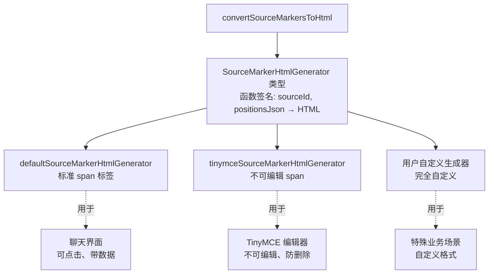

### 错误处理策略表

| 场景                | 处理方式          | 降级策略           | 用户反馈 | 日志记录       |
| ------------------- | ----------------- | ------------------ | -------- | -------------- |
| text 为空           | 返回空字符串/原文 | -                  | 无       | 否             |
| traces 为空         | 返回原文          | -                  | 无       | 否             |
| entities 为空       | 返回原文          | -                  | 无       | 否             |
| value 不存在于 text | 跳过该溯源点      | 处理其他有效溯源点 | 无       | 是（警告级别） |
| 正则匹配失败        | 返回原文          | -                  | 无       | 是（错误级别） |
| HTML 生成器异常     | 使用默认生成器    | 降级到默认实现     | 无       | 是（错误级别） |
| 位置解析失败        | 跳过该位置        | 处理其他有效位置   | 无       | 是（警告级别） |
| URL 生成失败        | 保留原 NER 链接   | 不转换为 HTML      | 无       | 是（错误级别） |
| 实体 key 冲突       | 优先保留第一个    | 去重处理           | 无       | 否             |

## 🌍 可访问性与国际化

### 可访问性支持表

| 考虑点     | 实现方案                  | 作用                   | 相关标准       |
| ---------- | ------------------------- | ---------------------- | -------------- |
| 键盘导航   | span/a 标签支持 tabindex  | 键盘用户可以聚焦和跳转 | WCAG 2.1       |
| 屏幕阅读器 | 添加 aria-label 属性      | 描述溯源和实体信息     | ARIA 1.2       |
| 焦点指示   | CSS :focus 样式           | 明确当前焦点位置       | WCAG 2.1       |
| 点击区域   | 足够的点击热区（padding） | 便于触摸操作           | 最小 44x44px   |
| 颜色对比   | 溯源标记和实体链接的颜色  | 确保可读性             | 对比度 ≥ 4.5:1 |
| 语义化标签 | 使用 span 和 a 标签       | 正确的语义结构         | HTML5          |

### 国际化支持表

| 文案类型     | 中文                | 英文                     | 翻译方式   | 备注                |
| ------------ | ------------------- | ------------------------ | ---------- | ------------------- |
| 溯源标记显示 | [3]                 | [3]                      | -          | 数字通用，无需翻译  |
| 位置分隔符   | 中文逗号（，）      | 英文逗号（,）            | 代码处理   | 根据语言环境        |
| 溯源 Tooltip | "来源：RAG 数据3"   | "Source: RAG Data 3"     | i18n 函数  | 悬停提示            |
| 模型标识     | "回答使用模型: GPT" | "Answered by model: GPT" | `t()` 函数 | appendModelTypeInfo |
| 实体 Tooltip | "公司编码：123456"  | "Company Code: 123456"   | i18n 函数  | 悬停提示            |
| 跳转提示     | "查看来源"          | "View Source"            | i18n 函数  | 按钮文案            |

### 文案可变长度处理

| 场景         | 处理策略                | 原因               | 实现方式                              |
| ------------ | ----------------------- | ------------------ | ------------------------------------- |
| 溯源标记文本 | 固定为 [索引]，宽度可控 | 避免布局变化       | CSS: display: inline-block; min-width |
| 实体链接文本 | 支持任意长度，允许换行  | 实体名称可能很长   | CSS: word-break: break-word           |
| Tooltip 文案 | 支持多行显示            | 适应长文案         | CSS: white-space: pre-wrap; max-width |
| 位置字符串   | 允许任意长度            | 数据属性不影响布局 | -                                     |
| 模型标识     | 固定格式，单行显示      | 模型类型通常较短   | CSS: white-space: nowrap              |

## 🚫 非目标与不包含

### 不包含的功能

- **RAG 数据管理**：不负责 RAG 数据的加载、存储和管理
- **跳转逻辑**：不实现点击标记/链接后的跳转逻辑（由外部事件处理）
- **样式定义**：不定义溯源标记和实体链接的视觉样式（颜色、字体等）
- **RAG 数据展示**：不负责 RAG 数据的展示界面
- **实体详情展示**：不负责实体详情页的内容
- **复制事件监听**：不监听复制事件（由外部组件处理）
- **URL 路由跳转**：不处理页面路由跳转逻辑
- **权限校验**：不校验用户是否有权查看 RAG 数据或实体

### 不处理的场景

- **实时编辑**：不支持用户手动编辑溯源标记（TinyMCE 除外）
- **标记验证**：不验证标记的位置是否真实存在于 RAG 数据
- **实体验证**：不验证实体编码是否真实存在
- **权限控制**：不处理用户是否有权查看 RAG 数据或实体
- **性能监控**：不内置性能监控（由外部埋点系统处理）
- **A/B 测试**：不处理功能开关和灰度发布
- **数据统计**：不统计点击率、跳转率等数据

### 外部依赖说明

| 依赖模块      | 作用          | 提供方         | 备注                                      |
| ------------- | ------------- | -------------- | ----------------------------------------- |
| gel-api       | 类型定义      | 后端 API 团队  | ChatTraceItem、ChatEntityRecognize 等类型 |
| link/generate | URL 生成      | 前端路由模块   | 生成公司详情页 URL                        |
| intl          | 国际化        | 前端国际化模块 | t() 翻译函数                              |
| env           | 环境判断      | 前端环境模块   | usedInClient() 判断运行环境               |
| UI 组件       | Markdown 渲染 | 前端组件库     | 渲染 HTML 富文本                          |
| 复制事件      | 监听复制      | 外部组件       | 调用 stripMarkdownAndTraces               |

## ✅ 检查清单（布局与功能）

### 完整性检查

- [x] 8 个核心函数均有详细设计
- [x] 统一入口 formatAIAnswerFull 流程清晰
- [x] 所有函数均有处理流程图
- [x] 输入输出数据结构完整定义
- [x] 边界条件和错误处理明确
- [x] 同段落合并逻辑清晰
- [x] 表格特殊处理规则明确
- [x] 实体识别长度排序逻辑清晰
- [x] 实体占位符机制清晰
- [x] HTML 生成器扩展机制完整
- [x] 从后向前插入策略明确
- [x] 位置排序去重规则清晰

### 流程检查

- [x] 端到端流程完整可追踪
- [x] 数据流向时序图清晰
- [x] 模块依赖关系明确
- [x] 不同展示场景的处理流程清晰
- [x] 用户交互流程端到端可追踪
- [x] 状态机转换路径清晰

### 扩展性检查

- [x] HTML 生成器可自定义扩展
- [x] 实体类型可扩展（不限于 company）
- [x] 溯源来源类型可配置
- [x] 模型类型可扩展
- [x] 国际化文案可翻译
- [x] 函数职责边界清晰，便于复用和扩展

### 可用性检查

- [x] 可访问性支持完整
- [x] 国际化支持完整
- [x] 错误处理策略完善
- [x] 降级策略清晰
- [x] 日志记录规范
- [x] 文案可变长度处理

## 📊 性能与优化

### 性能指标

| 指标             | 目标值      | 测量方式           | 优化策略               |
| ---------------- | ----------- | ------------------ | ---------------------- |
| 格式化耗时       | < 50ms      | console.time       | 避免多次遍历，合并操作 |
| 转换为 HTML 耗时 | < 30ms      | console.time       | 正则优化，减少替换次数 |
| 内存占用         | < 5MB       | performance.memory | 及时释放临时变量       |
| 最大处理文本长度 | 50,000 字符 | 压力测试           | 超长文本分段处理       |

### 算法复杂度

| 函数                       | 时间复杂度           | 空间复杂度   | 瓶颈分析                         |
| -------------------------- | -------------------- | ------------ | -------------------------------- |
| formatAIAnswerFull         | O(n + m + k)         | O(n + m + k) | n=文本长度，m=溯源数，k=实体数   |
| filterTracesByValidSource  | O(m \* p)            | O(m)         | m=溯源数，p=每个溯源的 traced 数 |
| insertTraceMarkers         | O(n + m\*log(m) + k) | O(m + k)     | n=文本长度，m=溯源数，k=插入点数 |
| insertEntityMarkdownLinks  | O(n * e + e*log(e))  | O(e)         | n=文本长度，e=实体数             |
| convertSourceMarkersToHtml | O(n \* m)            | O(m)         | n=文本长度，m=标记数             |

### 优化建议

| 场景     | 优化策略             | 效果                 |
| -------- | -------------------- | -------------------- |
| 大量实体 | 使用 Trie 树优化匹配 | O(n*e) → O(n*log(e)) |
| 大量溯源 | 分批处理，避免阻塞   | 提升响应速度         |
| 超长文本 | 分段处理，流式输出   | 避免内存溢出         |
| 频繁调用 | 结果缓存（相同输入） | 减少重复计算         |

## 📚 相关文档

- [AI 对话模块需求文档](./chat-flow-requirements.md)
- [聊天核心流程前端设计文档](./chat-flow-core-design.md)
- [聊天流程技术设计](./chat-flow-technical-design.md)
- [gel-util 工具函数文档](../../../../gel-util/README.md)
- [gel-api 类型定义文档](../../../../types/README.md)

## 🔗 快速链接

### 源码文件

- 统一入口：`packages/gel-util/src/common/md/formatAIAnswerFull.ts`
- 溯源过滤：`packages/gel-util/src/common/md/filterTracesByValidSource.ts`
- 溯源插入：`packages/gel-util/src/common/md/insertTraceMarkers.ts`
- 实体链接：`packages/gel-util/src/common/md/insertEntityMarkdownLinks.ts`
- 模型标识：`packages/gel-util/src/common/md/appendModelTypeInfo.ts`
- 溯源转HTML：`packages/gel-util/src/common/md/convertSourceMarkersToHtml.ts`
- NER转HTML：`packages/gel-util/src/common/md/convertNerLinksToHtml.ts`
- 清除标记：`packages/gel-util/src/common/md/stripMarkdownAndTraces.ts`
- 工具函数：`packages/gel-util/src/common/md/sourceMarkerUtils.ts`
- 导出索引：`packages/gel-util/src/common/md/index.ts`

### 使用示例

```typescript
// 完整流程示例
import { formatAIAnswerFull, convertSourceMarkersToHtml, convertNerLinksToHtml } from 'gel-util/common'

// 1. AI 回答生成后，统一格式化
const markdownText = formatAIAnswerFull({
  answers: aiResponse.text,
  traceContent: aiResponse.traces,
  content: aiResponse.content,
  suggest: aiResponse.suggest,
  entity: aiResponse.entities,
  modelType: EModelType.GPT,
})

// 2. 展示到聊天界面
let htmlText = convertSourceMarkersToHtml(markdownText)
htmlText = convertNerLinksToHtml(htmlText, isDev)

// 3. 渲染到 UI
<MarkdownRenderer content={htmlText} />
```
