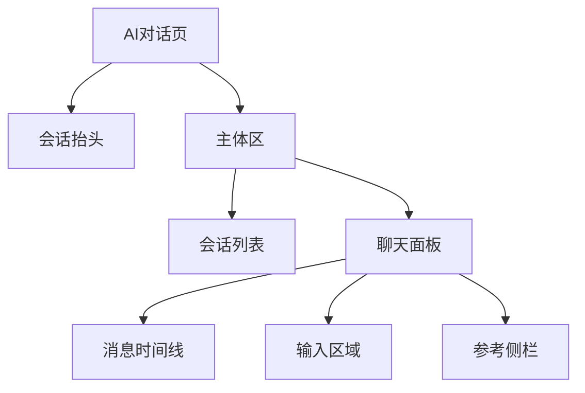
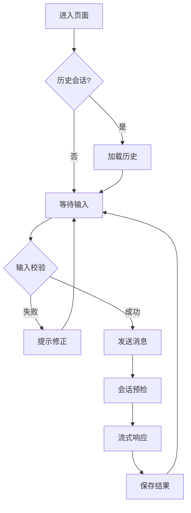

# AI Chat 功能需求规格

## 功能概述

提供业务用户的自然语言问答入口，支持多轮会话、流式响应和会话管理的完整对话体验。

## 核心功能

### 基础对话
- 自然语言输入（≤2000字符）
- 多轮上下文理解
- 实时流式响应
- 会话生命周期管理

### 扩展能力
- 附件上传解析
- 流式中断/恢复
- 消息重试机制
- 一键复制分享

### 数据增强
- DPU/RAG溯源展示
- 实体识别链接
- 结构化数据可视化
- 智能建议推荐

## 页面布局

| 区域 | 功能 | 操作 | 显示条件 |
| ---- | ---- | ---- | -------- |
| 会话抬头 | 会话状态 | 切换实体、刷新 | 始终显示 |
| 会话列表 | 历史记录 | 打开、固定、删除 | 有历史记录 |
| 消息时间线 | 对话内容 | 滚动、点击交互 | 始终显示 |
| 参考侧栏 | 扩展信息 | 查看溯源、实体 | 有数据时显示 |
| 输入区域 | 用户输入 | 输入、发送、取消 | 始终显示 |

## 业务流程

## 核心数据

| 数据类型 | 字段要求 | 限制说明 |
| -------- | -------- | -------- |
| 会话信息 | chatId, title, updateTime | title ≤ 60字符 |
| 用户消息 | messageId, content, attachments | content ≤ 2000字符 |
| AI消息 | content, status, reasoning | 支持流式状态 |
| 建议数据 | subQuestions[], suggestions[] | 最多各4条 |
| 参考数据 | traceContent[], entities[] | 按段落去重 |

## 错误处理

- **预检错误**: 输入验证、敏感内容检测
- **流式错误**: 网络中断、超时、解析失败
- **系统错误**: 服务不可用、权限不足

## 性能指标

- 首字节响应 < 2秒
- 流式延迟 < 500ms
- 支持1000+消息/会话
- 10+并发会话支持

---

*相关实现: `src/biz/ai-chat/`, `src/service/ai-chat/`*