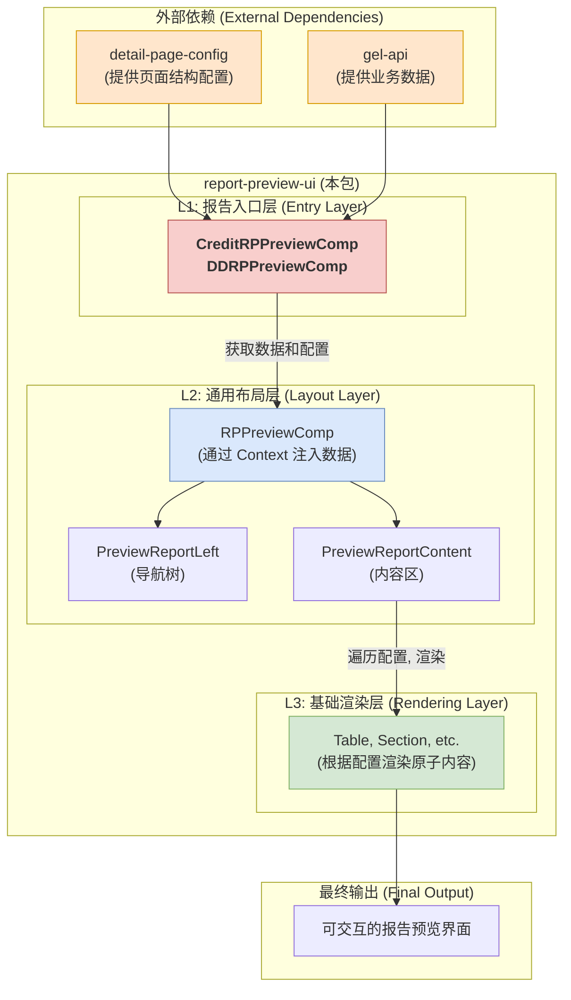

# 🖼️ `report-preview-ui` - 配置驱动的报告预览React组件库

## 🎯 它是什么？

`report-preview-ui` 是一个独立的 React 组件库，它的核心任务是将来自 `detail-page-config` 的 **JSON 配置** 和从 API 获取的 **业务数据**，转换为用户可以交互的、功能丰富的**报告预览界面**。

## 核心理念：配置驱动与分层解耦

本库通过两大核心设计实现了高度的灵活性和可维护性：
1.  **配置驱动 (Configuration-Driven)**: UI 的结构、内容和渲染方式完全由外部传入的配置对象决定。组件本身不包含任何写死的业务逻辑。
2.  **分层解耦 (Layered Decoupling)**: 组件被严格划分为三个层次，各司其职，从数据获取到最终渲染，清晰地分离了不同维度的关注点。

### 工作流与组件架构

下面的图表清晰地展示了数据、配置和组件之间的协作关系：



### 三层组件架构详解

| 层次 (Layer) | 核心组件 (Key Component) | 主要职责 (Core Responsibilities) |
| :--- | :--- | :--- |
| **L1: 报告入口层** | `CreditRPPreviewComp`, `DDRPPreviewComp` | **数据与配置的整合者**。作为对外的唯一入口，负责获取特定报告所需的所有数据和JSON配置。|
| **L2: 通用布局层** | `RPPreviewComp`, `PreviewReportLeft`, `PreviewReportContent` | **界面的骨架与协调者**。搭建通用三段式布局，通过 Context 注入数据，并处理全局交互（如缩放、滚动联动）。|
| **L3: 基础渲染层** | `SectionHeading`, `Table` (及各种表格渲染器) | **JSON配置的最终执行者**。根据配置对象的 `type` 字段，递归地渲染出具体的原子内容（表格、标题等）。|

### 表格渲染的特殊说明

本包内 `handle/table` 目录下的逻辑是整个库最复杂的部分。它专门负责将 `detail-page-config` 中定义的抽象表格配置（如 `crossTable`, `horizontalTable`）解析并转换为 `wind-ui` 表格组件能理解的 `columns` 和 `dataSource` props，并包含了大量复杂的单元格自定义渲染器。

## 设计目的

- **解耦与复用**: 将 UI 从主应用中解耦，使预览组件可在公司内多个平台（如报告平台、CRM）中被轻松复用。
- **独立开发与测试**: 借助 `Storybook`，可独立于业务应用进行组件开发和测试，极大提升效率和质量。
- **健壮性**: 清晰的依赖和统一的入口，让集成和维护都更加方便和健壮。

## 技术栈与核心依赖

- **核心框架**: `React` (v18)
- **UI 基础**: `@wind/wind-ui` (内部包), 提供了表格、按钮、布局等基础 UI 元素。
- **构建与开发**:
  - `Vite`: 用于快速的开发、构建和预览。
  - `Storybook`: 用于组件的独立开发、测试和文档展示。
- **语言与样式**:
  - `TypeScript`: 提供静态类型检查。
  - `Less` & `CSS Modules`: 用于组件样式开发。
- **核心运行时依赖**:
  - `detail-page-config` (内部包): **配置驱动的基石**。提供渲染报告所需的完整页面结构化配置。
  - `report-util` (内部包): 提供共享的数据格式化、表格转换等底层工具函数。
  - `gel-api` (内部包): 提供所有与后端 API 通信的类型定义和请求函数。
  - `axios`: 用于执行 HTTP 请求，从后端获取业务数据。

## 使用方法

作为一个标准的 React 组件库，可以通过 NPM/PNPM 引入 `report-preview-ui` 包，并导入其主 CSS 文件和所需组件。

```jsx
import { CreditRPPreviewComp } from 'report-preview-ui';
import 'report-preview-ui/dist/style.css';

function MyReportPage() {
  // ...
  return (
    <CreditRPPreviewComp
      corpCode="YOUR_COMPANY_CODE"
      axiosInstance={myAxiosInstance}
      // ... other props
    />
  );
}
```

> **注意**：这是一个内部包，强依赖于 `@wind/wind-ui`, `gel-api`, `detail-page-config` 等其他内部NPM包。
