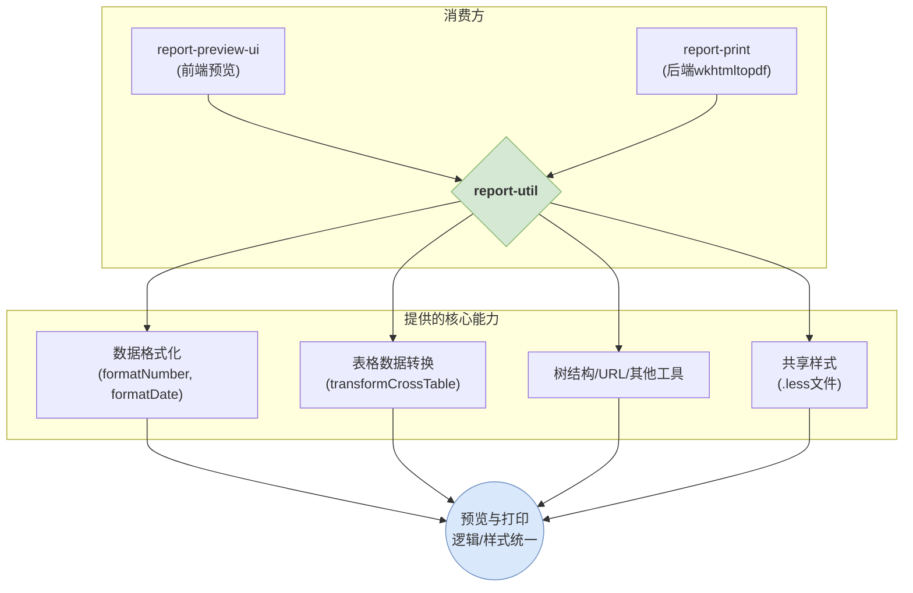

# 🔧 `report-util` - 报告生成核心工具集

## 🎯 它是什么？

`report-util` 是一个**零依赖**、**`wkhtmltopdf`-安全**的底层工具函数库。它的唯一目标是为报告系统提供一系列稳定、可复用、环境兼容的底层能力，如数据格式化、表格数据转换、树结构操作等。

## 核心理念：一份工具，两端复用

本包处于报告生成流程的最底层，被**前端预览 (`report-preview-ui`)** 和 **后端打印 (`report-print`)** 共同依赖。这保证了预览和最终生成的 PDF 在数据处理、格式化逻辑和基础样式上拥有一致的表现。



## ❗ 核心约束：为 `wkhtmltopdf` 而设计 ❗

**警告：此包是 `report-print` 项目的核心依赖。所有代码最终都在 `wkhtmltopdf` 的老旧 JavaScript 引擎 (约等于 ES5) 中执行。**

这意味着，在此包中编写的任何代码都必须遵守极其严格的规范：

1.  **禁止使用现代 JS 语法/API**:
    -   严禁使用 **ES6+** 的任何新语法（如 `let`, `const`, `() => {}`, `...spread`）。
    -   严禁使用现代数组/对象方法，如 `Array.prototype.includes`, `Object.values`, `Promise` 等。
2.  **无 Polyfill 环境**: `wkhtmltopdf` 执行环境中**没有** `core-js` 或类似的 polyfill 库。代码必须是原生、自包含的 ES5 兼容代码。
3.  **强制回归测试**: 任何代码变更，都**必须**在 `report-print` 项目中通过 `wkhtmltopdf` 实际生成报告进行回归测试。

> **违反这些约束将直接导致线上报告生成失败。**

## 核心模块一览

项目高度模块化，通过不同的子路径导出功能。这种设计允许消费方按需导入，减小最终产物的体积。

| 模块路径 | 核心功能 | 示例与说明 |
| :--- | :--- | :--- |
| **`report-util/format`** | **数据格式化** | `formatNumber`, `formatMoney`, `formatDate` |
| **`report-util/table`** | **表格数据转换** | `transformCrossTablePropsToVerticalTableProps` (核心横纵表转换) |
| **`report-util/tree`** | **树状数据操作** | `updateHiddenTreeNodes` (更新节点隐藏状态) |
| **`report-util/url`** | **URL处理** | `urlParams` (解析URL参数) |
| **`report-util/misc`** | **通用工具集** | `replaceScript` (安全), 数组/数值/Base64 等操作 |
| **`report-util/style`** | **共享样式** | `.less` 文件，确保打印与预览样式统一 |
| **`report-util/constants`**| **共享常量** | 资源路径、联系信息、i18n辅助文本 |

## 技术栈与核心依赖

- **构建工具**: 使用 `Vite` 高效构建，同时生成 CJS, ESM 和 `.d.ts` 类型定义文件。
- **代码质量**: 通过 `ESLint` 和 `Prettier` 保证代码风格与质量。
- **测试**: 使用 `Jest` 进行单元测试。
- **核心依赖**:
  - `lz-string` (特殊依赖): 用于对超长 URL 参数进行高效的 **Lempel-Ziv 压缩/解压**。这是为了解决浏览器 URL 长度限制问题，在报告页面间通过 URL 传递大量配置状态时非常关键。
- **设计特点**:
  - **运行时依赖极少**: 同样为了 `wkhtmltopdf` 的兼容性，严格控制运行时依赖。

## 使用方法

```typescript
// 按需从特定模块导入函数
import { formatNumber } from 'report-util/format';
import { replaceScript } from 'report-util/misc';

const formattedValue = formatNumber(12345.67, { decimalPlaces: 2 }); // "12,345.67"
const safeHtml = replaceScript('<p>hello<script>alert("xss")</script></p>'); // "<p>hello</p>"
```