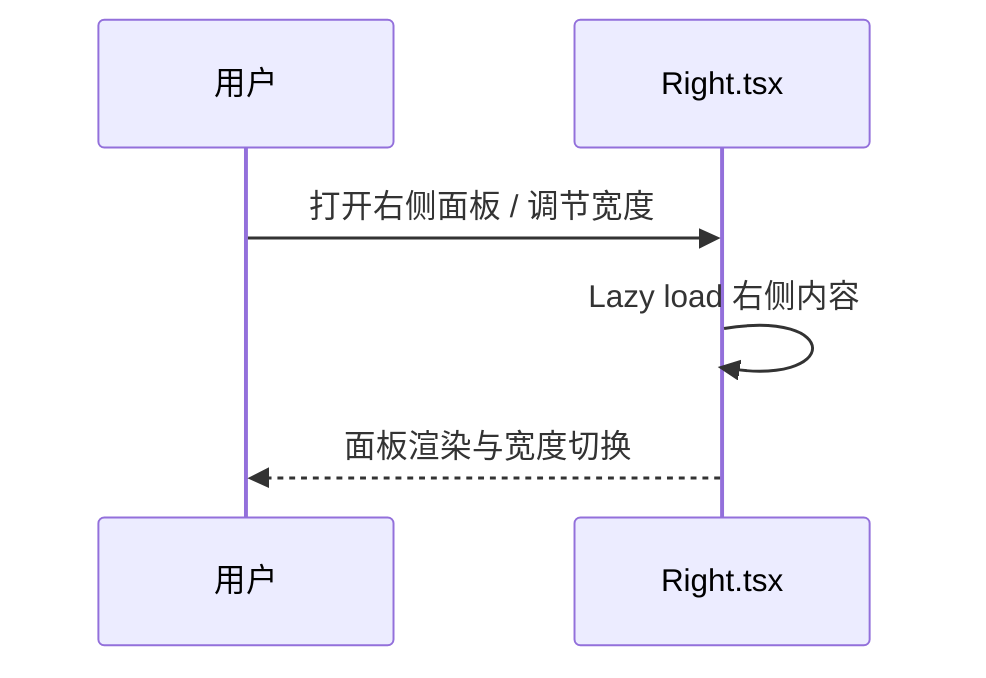

# Company 全球企业信息平台 | 2023.10 - 2024.06

**角色**：核心开发者（核心模块开发与性能优化）  
**项目背景**：为专业分析师提供全球企业信息检索与可视化，需在多类型企业与大规模数据场景下保持性能与一致性。  
**核心技术栈**：React 18、TypeScript、Redux、Webpack 5、Ant Design 5、@tanstack/react-virtual、ahooks

## 1. 全景架构（Situation & Task）

### 1.1 场景与目标
- 聚合企业基本面/财务/风控/知识产权等多维数据，提供统一查询与可视化。
- 右侧信息面板需要在宽屏/窄屏间自适应切换，并承载动态内容（对话能力详见其他项目经历，此处不展开）。

### 1.2 架构视图
```mermaid
graph TD
    U[分析师 / 风控人员] --> FE[Company SPA<br/>React18 + Redux + Webpack5]
    FE --> RightPanel[右侧信息面板<br/>延迟加载 + 虚拟列表]
    FE --> MenuCfg[菜单/模块配置<br/>配置驱动渲染]
    FE --> EntAPI[企业信息 API (entWebAxiosInstance)]
    FE --> Shared[gel-ui / gel-util<br/>内部组件与工具]
```

### 1.3 技术选型 / ADR
| 决策点 | 选择 | 对比 | 理由/证据 |
| --- | --- | --- | --- |
| 构建与兼容性 | Webpack 5 + 自定义脚本 | Vite | 需兼容旧版 Chrome（`getGapCompatTransformer` + `legacyLogicalPropertiesTransformer`，见 `CompanyDetailAIRight/Right.tsx`），同时保留既有脚手架与 analyzer 链路。 |
| 长列表虚拟化 | `@tanstack/react-virtual` | `react-window` | 需支持动态高度与分组消息的滚动补偿，`useVirtualChat.ts` 中使用 `estimateSize` + `rowVirtualizer.measure()` 适配折叠/展开场景。 |
| 首屏性能 | React.lazy + Suspense 加载右侧面板 | 直接同步加载 | 右侧面板按需显隐，懒加载能减轻首屏体积并避免未使用时的样式/依赖开销。 |

## 2. 核心功能实现（Core Features & Implementation）

### Feature 1：右侧信息面板与布局
- **实现逻辑**：`CompanyDetailAIRight/Right.tsx` 延迟加载右侧内容，通过 `StyleProvider` 和 `getGapCompatTransformer` 兼容低版本浏览器；利用 `onWidthChange`/`onShowRight` 控制 25%/50% 自适应宽度和显示状态。
- **时序**：

- **复杂度**：需要同时处理布局自适应、延迟加载首屏性能和兼容性降级。

### Feature 2：配置驱动的菜单/内容联动
- **实现逻辑**：企业详情的菜单与内容模块由配置驱动（见 `docs/CorpDetail/layout-config.md`），特殊企业需按菜单可见性过滤模块。`CompanyBase` 和 `useCorpMenuByType` 依据 `basicNum.__specialcorp` 和地区/类型配置决定模块渲染。
- **复杂度**：同一模块的统计字段与可见性规则需在菜单/内容侧保持一致，否则会出现“菜单可见但模块缺失”的不一致；需要兼顾海外企业与个体工商户的差异化过滤。

### Feature 3：动态列表与滚动性能
- **实现逻辑**：右侧列表采用 `@tanstack/react-virtual` 进行虚拟化；`useVirtualChat.ts` 通过动态高度预估与滚动补偿保持长列表流畅（业务细节已在其他项目记录，此处仅保留性能实现）。
- **复杂度**：需要在历史插入（顶部）时保持滚动锚点，并兼容折叠面板展开后的高度变化。

## 3. 核心难点攻坚（Action & Result）

### 案例 A：配置重复维护导致菜单/内容不一致
- **现象**：左侧菜单与中间内容分别维护顺序、统计字段与过滤规则，特殊企业出现“菜单有项但内容缺失”。
- **排查**：`listRowConfig.tsx` 全量导入模块，`useCorpMenuByType.ts` 单独维护过滤；海外/个体工商户逻辑分散在多处（见 `docs/specs/layout-config-duplication`）。
- **V2（方案）**：设计统一配置源与按需加载（实施计划见 `spec-implementation-v2.md`）：  
  - 统一模块元数据，菜单/内容共享统计字段与可见性。  
  - 内容侧按需加载，避免未显示模块的配置与组件提前加载。  
  - 特殊企业过滤集中在单一入口，去掉双重维护。
- **结果**：消除菜单/内容不一致风险，降低首屏加载的无效配置体积。

### 案例 B：长列表滚动抖动（动态高度场景）
- **现象**：右侧列表在插入历史记录或展开折叠面板时产生跳动。
- **排查**：高度变更后未重新测量，滚动补偿缺失。
- **V2（方案）**：在 `useVirtualChat.ts` 用 `useVirtualizer` + `rowVirtualizer.measure()` 强制重测，并在历史插入时计算新增高度补偿 `scrollTop`，折叠展开时用 `ensureElementVisible` 定位。
- **结果**：长列表保持锚点稳定，动态高度变化不再影响视口位置。

## 4. 事故与反思（Post-Mortem）

- **Timeline**：QA 在旧版 Chrome 83 发现右侧面板控制区布局错位 → 排查定位到 `gap`/逻辑属性不被支持 → 在 `Right.tsx` 引入 `StyleProvider` + `getGapCompatTransformer`/`legacyLogicalPropertiesTransformer` 针对旧版浏览器降级 → 回归确认正常。
- **Root Cause**：样式依赖 CSS `gap` 与逻辑属性，旧版浏览器未实现，导致控制区挤压。
- **Action Items**：  
  - 保留 `needsBrowserCompat()` 探测，仅在低版本启用转换器，避免现代浏览器受影响。  
  - 将旧版浏览器快照纳入视觉回归基线；新增 Storybook “compat mode” 场景验证右侧面板。  
  - 在构建链保留 Webpack analyzer，持续关注第三方组件对低版本的样式回退。

## 5. 知识库（Legacy）

- **虚拟滚动 + 历史补偿模板**：`useVirtualChat.ts` 展示了在动态高度场景下通过 `rowVirtualizer.measure()` 与 `scrollTop + addedHeight` 补偿保持视口稳定，可复用到其他分组列表。  
- **兼容性样式降级模板**：`CompanyDetailAIRight/Right.tsx` 中结合 `StyleProvider`、`getGapCompatTransformer` 与 `legacyLogicalPropertiesTransformer` 对旧版 Chrome 进行样式降级，可复用到其他需要逻辑属性降级的组件。  
