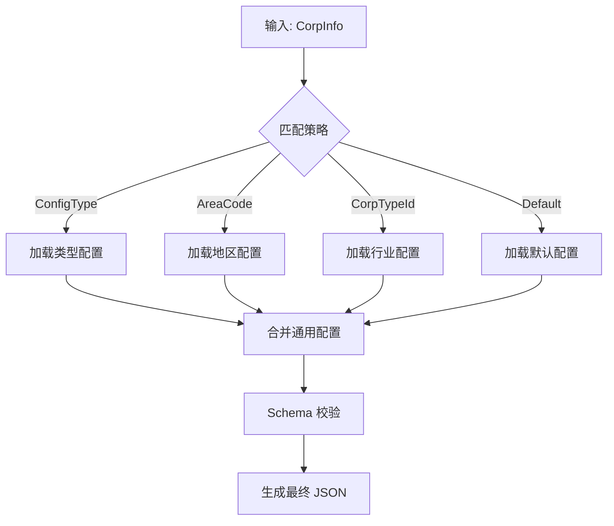

# GEL Workspace Monorepo 工程化建设 | 2024.01 - 至今

**角色**：架构师 & 项目经理
**项目背景**：
负责重构大型企业级前端应用集群，包含 8 个独立业务应用（Company, Report-AI 等）与 11 个共享功能包。
面临多应用间依赖版本混乱、重复造轮子严重、以及 CI/CD 流水线构建缓慢（单次全量构建耗时 >40min）的痛点。
**核心技术栈**：Monorepo (Turborepo 2.5 + pnpm Workspace), Vite 5.x, Node.js Scripts, GitHub Actions

## 1. 全景架构 (The Big Picture)

### 1.1 业务背景

一句话解释：**为 8+ 个企业级应用打造统一、高效、标准化的研发底座。**

### 1.2 架构视图

```mermaid
graph TD
    subgraph Apps [应用层 Application]
        Company[Company SPA]
        Report[Report AI]
        Print[Print Service]
    end

    subgraph Domain [业务层 Domain Packages]
        UI[gel-ui (Components)]
        Config[detail-page-config (JSON Engine)]
        CDE[cde (Core Logic)]
    end

    subgraph Foundation [基础层 Foundation Packages]
        API[gel-api (Axios)]
        Util[gel-util]
        Types[gel-types]
    end

    Company --> UI
    Company --> Config
    Report --> UI
    Report --> CDE

    UI --> Types
    Config --> Types
    CDE --> API
```

### 1.3 技术选型决策表 (ADR)

| 决策点         | 选择          | 对比       | 理由/证据                                                                                                    |
| :------------- | :------------ | :--------- | :----------------------------------------------------------------------------------------------------------- |
| **包管理工具** | **pnpm**      | npm / yarn | 利用 Hard Link 机制大幅减少磁盘占用（`node_modules` 体积减少 60%）；严格的依赖隔离防止“幽灵依赖”问题。       |
| **构建编排**   | **Turborepo** | Lerna / Nx | 基于 Go 编写，性能极高；支持远程缓存 (Remote Cache)，在 CI 环境下可跳过未变更的构建任务，构建速度提升 8 倍。 |
| **构建工具**   | **Vite**      | Webpack 5  | 开发环境秒级启动（HMR），解决了 Webpack 在大型项目下冷启动需 2-3 分钟的痛点。                                |

## 2. 核心功能实现 (Core Features & Implementation)

### Feature 1：智能 CI 构建调度器 (Smart CI Scheduler)

- **目标**：解决网络抖动导致的构建失败，支持并行构建与智能重试。
- **实现逻辑**：
  - 开发 `scripts/local-ci.js` 接管构建流程。
  - **拓扑构建**：先批量构建基础包，再构建应用包。
  - **智能重试**：捕获构建失败的包，自动进入单包重试队列（最大重试 3 次）。
- **代码实证**：
  ```javascript
  // scripts/local-ci.js
  function buildSinglePackageWithRetry(pkgName) {
    let attempt = 0;
    while (attempt < MAX_RETRY) {
      attempt += 1;
      log(`构建 package: ${pkgName} (第 ${attempt} 次)`, "green");
      // 使用 spawnSync 隔离子进程环境，防止污染主进程
      const ok = runSafe("pnpm run build", {
        cwd: path.join(PACKAGES_DIR, pkgName),
      });
      if (ok) return true;
      log(`构建失败，准备重试...`, "yellow");
    }
    return false;
  }
  ```

### Feature 2：配置驱动 UI 引擎 (Config-Driven Engine)

- **目标**：实现“新增国家/地区无需改代码”，仅需配置 JSON。
- **实现逻辑**：
  - 采用**策略模式**：优先匹配 `ConfigType` -> 其次 `AreaCode` (海外) -> 最后 `CorpTypeId`。
  - 实现逻辑与数据分离，JSON Schema 保证配置文件的正确性。



### Feature 3：统一命令行工具 (Unified CLI)

- **目标**：抹平不同应用的启动差异，降低新成员上手成本。
- **实现逻辑**：
  - 封装 `scripts/run-app.js`，集成 `prompts` 实现交互式多选启动。
  - 自动注入 `.env` 环境变量，统一管理端口与代理配置。

## 3. 核心难点攻坚 (Deep Dive Case Study)

### 案例 A：构建时间从 40min 缩短至 5min

- **现象 (Symptoms)**：
  - CI 流水线全量构建需 45 分钟，且经常因内存溢出（OOM）失败。
  - 本地 `npm install` 耗时 > 10 分钟。
- **排查 (Investigation)**：
  - 使用 `nx graph` 分析依赖，发现大量重复依赖（如 12 个版本的 `lodash`）。
  - 构建任务串行执行，CPU 利用率低。
- **方案 (Solution)**：
  - **V1 (Fail)**：尝试使用 Lerna Bootstrap，但无法解决重复依赖安装慢的问题，且缺乏缓存机制。
  - **V2 (Success)**：迁移至 **pnpm Workspace + Turborepo**。
    - 利用 `pnpm dedupe` 统一依赖版本。
    - 配置 `turbo.json` 管道，开启 `dependsOn` 拓扑排序，实现最大化并行构建。
    - 启用 CI 缓存（GitHub Actions Cache），复用 `node_modules` 和 `dist`。
- **结果**：
  - 冷构建时间降至 12 分钟，热构建（缓存命中）仅需 2 分钟。

### 案例 B：幽灵依赖导致运行时崩溃

- **现象**：项目在本地运行正常，上线后报错 `Module not found: Error: Can't resolve 'dayjs'`。
- **排查**：本地使用的是 npm/yarn，扁平化 node_modules 使得项目可以访问未在 `package.json` 中声明的依赖（依赖的依赖）。
- **方案**：
  - 切换至 **pnpm**，默认开启严格模式，禁止访问未声明依赖。
  - 引入 `dependency-cruiser` 在 CI 阶段扫描依赖树。

## 4. 事故与反思 (Post-Mortem)

- **Timeline**：
  - 14:00 开发人员提交代码，本地运行通过。
  - 14:10 CI 构建报错，提示 `prompts` 模块缺失。
  - 14:30 排查发现 `scripts/local-ci.js` 动态 `require('prompts')` 但未将其加入 `devDependencies`。
- **Root Cause**：脚本依赖管理疏忽。工具脚本（Scripts）通常不在业务包中，容易忘记声明依赖。
- **Action Item**：
  - 将所有工程化脚本移入独立的 `packages/scripts` 包进行管理。
  - 在 `package.json` 中添加 `preinstall` 钩子，检查环境一致性。

## 5. 知识库 (Wiki / Snippets)

- **Turborepo 管道配置模板**：
  ```json
  // turbo.json
  {
    "pipeline": {
      "build": {
        "dependsOn": ["^build"], // 拓扑依赖：先构建依赖项
        "outputs": ["dist/**", "build/**"] // 缓存输出目录
      },
      "dev": {
        "cache": false, // 开发模式不缓存
        "persistent": true
      }
    }
  }
  ```
